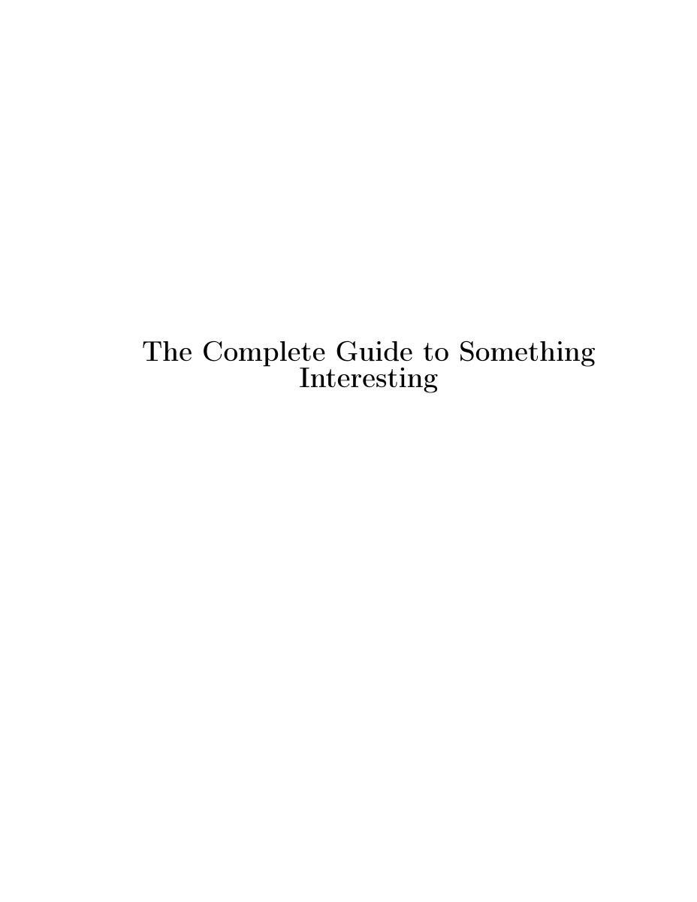
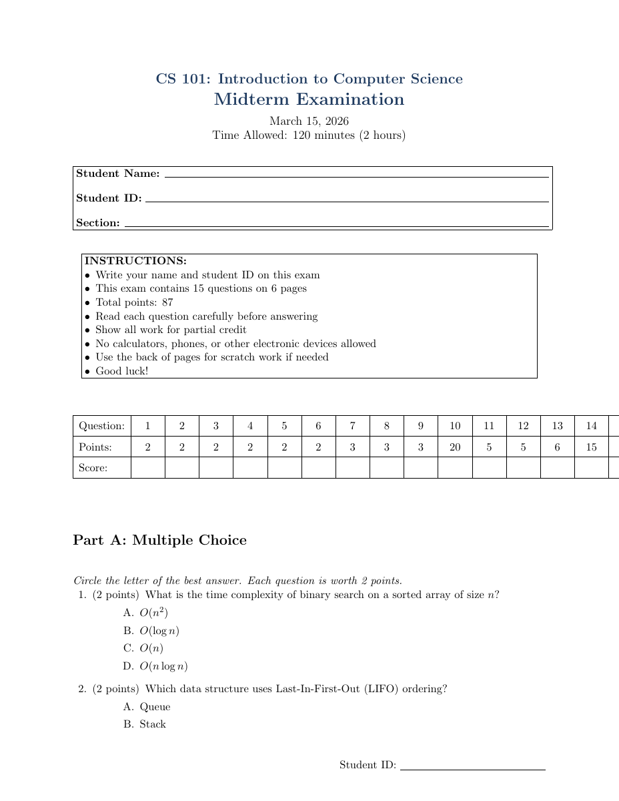
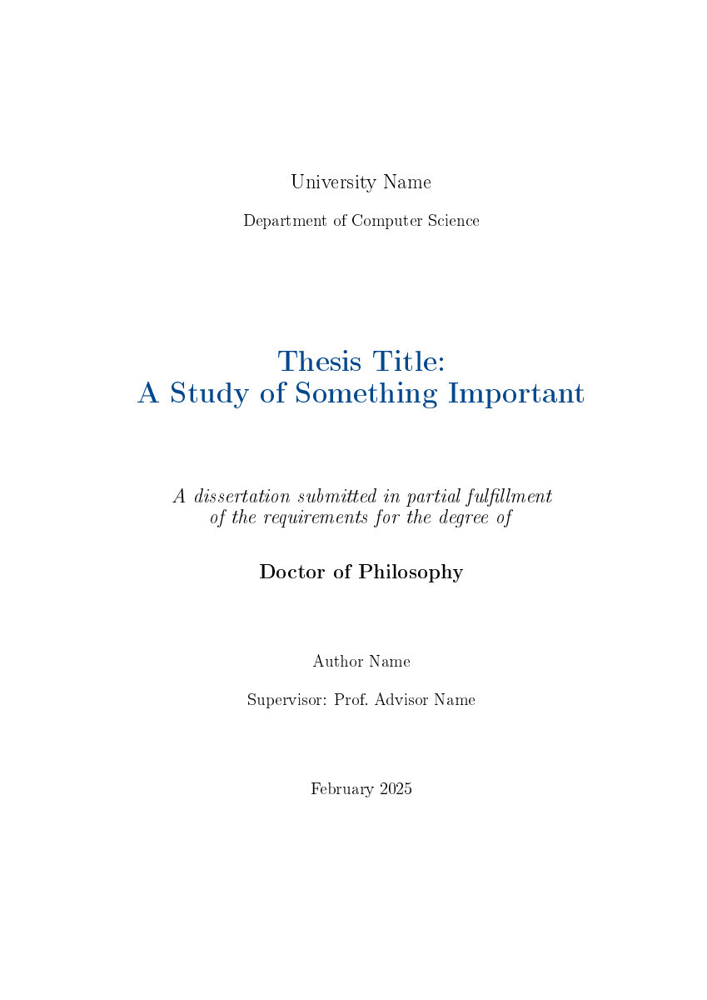

# latex-document

A Claude Code skill for creating, compiling, and converting any document to professional PDF with PNG previews. 19 templates, 6 scripts, and comprehensive reference guides covering resumes, reports, books, theses, posters, exams, letters, invoices, academic papers, presentations, charts, diagrams, format conversion, and PDF-to-LaTeX conversion.

## Features

- **19 production-ready templates** -- 5 ATS-optimized resume variants, book, thesis, academic CV, poster, exam, letter, report, cover letter, invoice, academic paper, presentation (Beamer), legacy resume, example .bib file
- **ATS-compatible resumes** -- researched against industry standards (Workday, Greenhouse, Taleo, iCIMS); single-column, no graphics, standard section headings
- **Book** -- full book with parts, chapters, front/back matter, index, epigraphs, custom chapter headings
- **Thesis/dissertation** -- `book` class with title page, declaration, abstract, acknowledgments, chapters, appendices, bibliography
- **Academic CV** -- multi-page CV with publications, grants, teaching, advising, service sections
- **Scientific poster** -- `tikzposter` class (A0) with 3-column layout, diagrams, charts, tables
- **Exam/quiz** -- `exam` class with grading table, MCQ, T/F, fill-in-blank, matching, short/long answer, solution toggle
- **Business letter** -- formal letter with colored letterhead, logo placeholder, signature block
- **Bibliography/citations** -- BibTeX and biblatex support with auto-detection in compile script; example `.bib` file with all entry types
- **Charts and graphs** -- bar, line, scatter, pie, heatmap, box, histogram, area, radar charts via pgfplots + matplotlib
- **Mermaid diagrams** -- flowcharts, sequence, class, ER, Gantt, pie, mindmap diagrams via mermaid-cli
- **Tables** -- colored rows, multi-row/column, booktabs, long tables, CSV-to-LaTeX conversion
- **Watermarks** -- text (DRAFT, CONFIDENTIAL), company logo background, header logos
- **Landscape pages** -- mixed portrait/landscape in single documents (pdflscape/lscape)
- **Multi-language** -- European (babel), CJK (xeCJK), RTL/Arabic (polyglossia), Cyrillic
- **Format conversion** -- Pandoc-based conversion between Markdown, DOCX, HTML, and LaTeX
- **PDF-to-LaTeX conversion** -- convert handwritten notes, printed reports, legal docs to LaTeX with empirically optimized scaling
- **Multi-engine support** -- auto-detects XeLaTeX (fontspec/xeCJK), LuaLaTeX (luacode), or pdflatex; glossary + index support
- **Auto-install** -- scripts automatically install TeX Live and poppler-utils if missing
- **PNG previews** -- every compiled PDF generates page-by-page PNG previews

## Templates

### Resume (ATS-Optimized)

5 templates designed to pass Applicant Tracking Systems. 98% of Fortune 500 companies use ATS to filter resumes before a human sees them.

| Template | Best For | ATS Score |
|---|---|---|
| Classic ATS | Finance, law, government -- maximum parse safety | 10/10 |
| Modern Professional | Tech, corporate -- good ATS + human appeal | 9/10 |
| Executive | VP/Director/C-suite -- two-page, leadership focus | 9/10 |
| Technical | Software/data/engineering -- skills-first, projects | 9/10 |
| Entry-Level | New graduates -- education-first, one page | 9/10 |


### Book


### Scientific Poster


### Exam / Quiz


### Business Letter


### Thesis / Dissertation


### Academic CV


### Report


### Cover Letter


### Invoice


### Academic Paper


### Presentation (Beamer)


### Charts and Graphs


## Installation

Copy the skill directory to your Claude Code skills path:

```bash
cp -r latex-document ~/.claude/skills/
```

Or install the `.skill` package if you have one.

## Usage

The skill triggers automatically when you ask Claude Code to:

- Create a resume, CV, or cover letter
- Write a thesis, dissertation, or book
- Create an academic CV with publications
- Make a scientific poster or exam
- Write a formal business letter
- Write any document in LaTeX
- Create a PDF with tables, charts, or images
- Generate Mermaid diagrams or matplotlib charts
- Convert CSV data to LaTeX tables
- Add watermarks (text or logo) to documents
- Compile a `.tex` file
- Make a report, invoice, or presentation
- Convert between Markdown, DOCX, HTML, and LaTeX
- Convert a PDF or handwritten notes to LaTeX
- Create slides
- Write multi-language documents (CJK, Arabic, European)

### Quick Examples

**"Make me a resume"** -- copies the resume template, customizes it with your info, compiles to PDF, and shows you the result.

**"Create a 300-page book about machine learning"** -- uses the book template with parts, chapters, index, bibliography.

**"Make an exam for my CS 101 class"** -- generates an exam with MCQ, T/F, short answer, essay questions with grading table.

**"Create a conference poster about my research"** -- uses the tikzposter template with 3-column layout, charts, tables.

**"Convert this PDF of my math notes to LaTeX"** -- splits the PDF into images, selects the math-notes conversion profile, and produces clean LaTeX.

**"Convert my report.docx to LaTeX"** -- uses Pandoc to convert DOCX to LaTeX with proper formatting.

**"Create a bar chart from this CSV data"** -- generates a matplotlib chart or pgfplots code, compiles, and delivers PDF + PNG.

## Scripts

### compile_latex.sh

Compiles `.tex` to PDF with automatic engine detection, multi-pass compilation, and PNG preview generation.

```bash
# Basic compile (auto-detects engine)
bash scripts/compile_latex.sh document.tex

# Compile + PNG previews
bash scripts/compile_latex.sh document.tex --preview

# Compile + PNG in specific directory
bash scripts/compile_latex.sh document.tex --preview --preview-dir ./outputs

# Force a specific engine
bash scripts/compile_latex.sh document.tex --engine xelatex
bash scripts/compile_latex.sh document.tex --engine lualatex
```

Auto-detects: `fontspec`/`xeCJK`/`polyglossia` -> xelatex, `luacode`/`luatextra` -> lualatex, otherwise pdflatex. Auto-runs bibtex/biber, makeindex, makeglossaries as needed.

### mermaid_to_image.sh

Converts Mermaid `.mmd` diagram files to PNG or PDF for LaTeX inclusion.

```bash
bash scripts/mermaid_to_image.sh diagram.mmd output.png
bash scripts/mermaid_to_image.sh diagram.mmd output.pdf --format pdf --theme forest
```

### generate_chart.py

Generates publication-quality charts using matplotlib (9 chart types).

```bash
python3 scripts/generate_chart.py bar \
    --data '{"x":["Q1","Q2","Q3","Q4"],"y":[120,150,180,210]}' \
    --output chart.png --title "Quarterly Revenue"

python3 scripts/generate_chart.py line --csv data.csv --output trend.pdf
```

Supports: bar, line, scatter, pie, heatmap, box, histogram, area, radar.

### csv_to_latex.py

Converts CSV files to formatted LaTeX tabular code.

```bash
python3 scripts/csv_to_latex.py data.csv --caption "Results" --label "tab:results"
python3 scripts/csv_to_latex.py data.csv --style booktabs --alternating-rows
```

### convert_document.sh

Pandoc wrapper for format conversion between Markdown, DOCX, HTML, and LaTeX.

```bash
bash scripts/convert_document.sh input.md output.tex
bash scripts/convert_document.sh input.docx output.tex --standalone --extract-media=./media
bash scripts/convert_document.sh input.tex output.docx
```

### pdf_to_images.sh

Splits PDF into page images for the PDF-to-LaTeX conversion pipeline.

```bash
bash scripts/pdf_to_images.sh input.pdf ./output-dir
bash scripts/pdf_to_images.sh input.pdf ./output-dir --dpi 300 --max-dim 2000
```

## PDF-to-LaTeX Scaling Strategy

Empirically tested on a 115-page handwritten math PDF across batch sizes 3, 5, 7, 10, and 15:

| PDF Size | Strategy | Agents | Error Rate |
|---|---|---|---|
| **1-10 pages** | Single agent | 1 | 0-2 minor (trivially fixable) |
| **11-20 pages** | Split in half | 2 | Avoids error cliff at 10+ pages |
| **21+ pages** | Batch-7 pipeline | ceil(N/7) | Optimal -- 0 errors per 7-page batch |

**Why batch-7**: Testing showed 0 errors at 7 pages, 2 structural errors at 10, and 11 catastrophic errors at 15. The error cliff between 10 and 15 pages is steep.

## Conversion Profiles

| Content Type | Profile | Specialization |
|---|---|---|
| Math / science | `math-notes.md` | amsmath, amsthm, theorem environments, custom commands |
| Business | `business-document.md` | fancyhdr, tabularx, financial tables, professional colors |
| Legal | `legal-document.md` | Roman numeral sections, 1.5 spacing, footnotes, nested clauses |
| General / mixed | `general-notes.md` | Minimal packages, adaptive structure |

## Reference Guides

| Guide | Topics |
|---|---|
| `bibliography-guide.md` | BibTeX, biblatex, citation styles, .bib format |
| `advanced-features.md` | Watermarks, landscape, multi-lang, code listings, algorithms, tcolorbox, siunitx, advanced charts, AI images |
| `charts-and-graphs.md` | pgfplots + TikZ chart reference |
| `mermaid-diagrams.md` | Flowcharts, sequence, class, ER, Gantt, pie, mindmap diagrams |
| `python-charts.md` | matplotlib chart generation (9 types) |
| `format-conversion.md` | Pandoc conversion pipeline (MD/DOCX/HTML/LaTeX) |
| `tables-and-images.md` | Tables, images, TikZ drawings |
| `packages.md` | Common LaTeX packages reference |
| `resume-ats-guide.md` | ATS rules, LaTeX pitfalls, keywords |
| `pdf-conversion.md` | Full PDF-to-LaTeX pipeline |

## Project Structure

```
latex-document/
├── SKILL.md                          # Main skill file
├── assets/
│   └── templates/                    # 19 compile-tested LaTeX templates
│       ├── resume-classic-ats.tex
│       ├── resume-modern-professional.tex
│       ├── resume-executive.tex
│       ├── resume-technical.tex
│       ├── resume-entry-level.tex
│       ├── resume.tex                # Legacy (not ATS-optimized)
│       ├── book.tex                  # Full book (book class)
│       ├── thesis.tex                # Thesis/dissertation (book class)
│       ├── academic-cv.tex           # Multi-page academic CV
│       ├── poster.tex                # Scientific poster (tikzposter)
│       ├── exam.tex                  # Exam/quiz (exam class)
│       ├── letter.tex                # Formal business letter
│       ├── report.tex
│       ├── cover-letter.tex
│       ├── invoice.tex
│       ├── academic-paper.tex
│       ├── presentation.tex
│       └── references.bib            # Example bibliography file
├── references/
│   ├── resume-ats-guide.md
│   ├── bibliography-guide.md
│   ├── advanced-features.md          # Watermarks, landscape, multi-lang, algorithms, tcolorbox, siunitx, charts, AI images
│   ├── charts-and-graphs.md
│   ├── mermaid-diagrams.md           # Mermaid diagram integration
│   ├── python-charts.md              # matplotlib chart generation
│   ├── format-conversion.md          # Pandoc conversion guide
│   ├── packages.md
│   ├── pdf-conversion.md
│   ├── tables-and-images.md
│   └── profiles/
│       ├── math-notes.md
│       ├── business-document.md
│       ├── legal-document.md
│       └── general-notes.md
├── scripts/
│   ├── compile_latex.sh              # Compile .tex to PDF + PNG (auto engine/bib/index/glossary)
│   ├── pdf_to_images.sh              # Split PDF into page images
│   ├── mermaid_to_image.sh           # Mermaid .mmd to PNG/PDF
│   ├── generate_chart.py             # matplotlib chart generation
│   ├── csv_to_latex.py               # CSV to LaTeX tabular
│   └── convert_document.sh           # Pandoc format conversion
└── examples/                         # Preview images for README
```

## License

MIT
