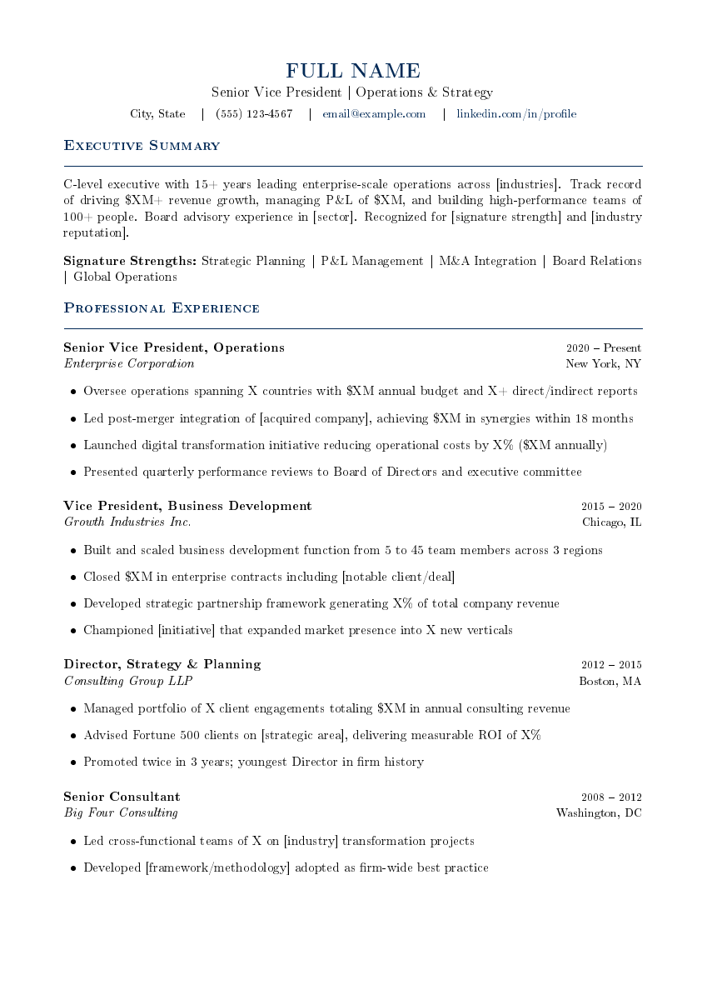
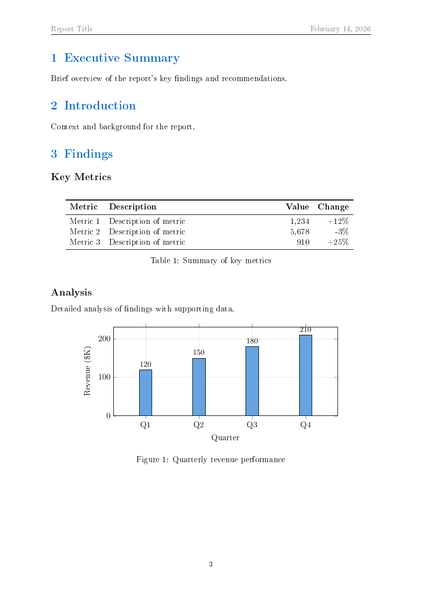
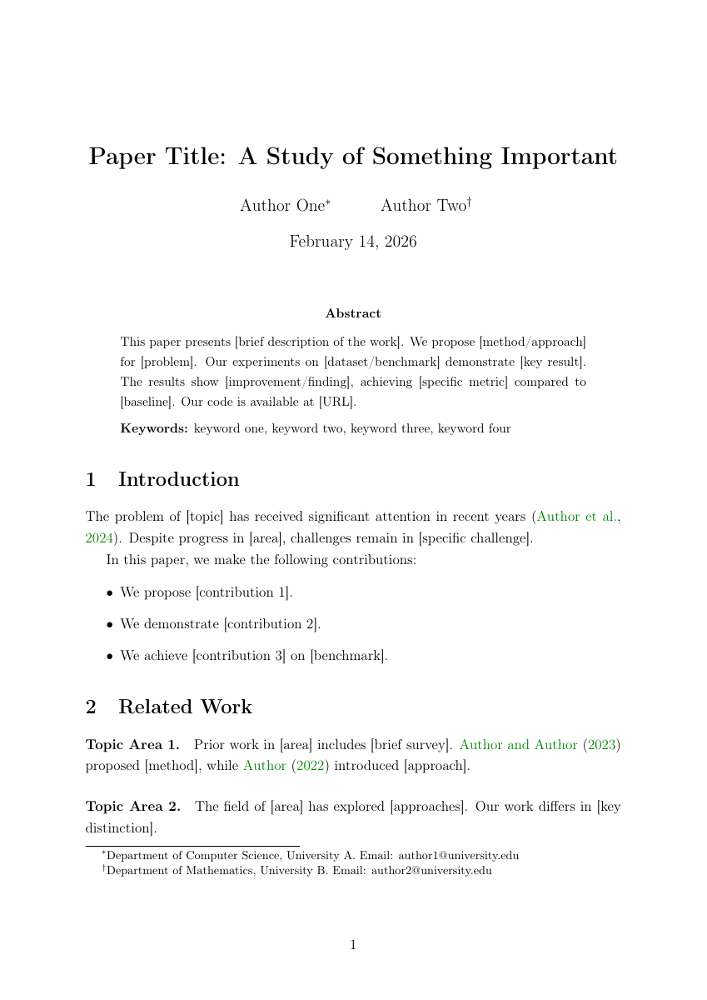
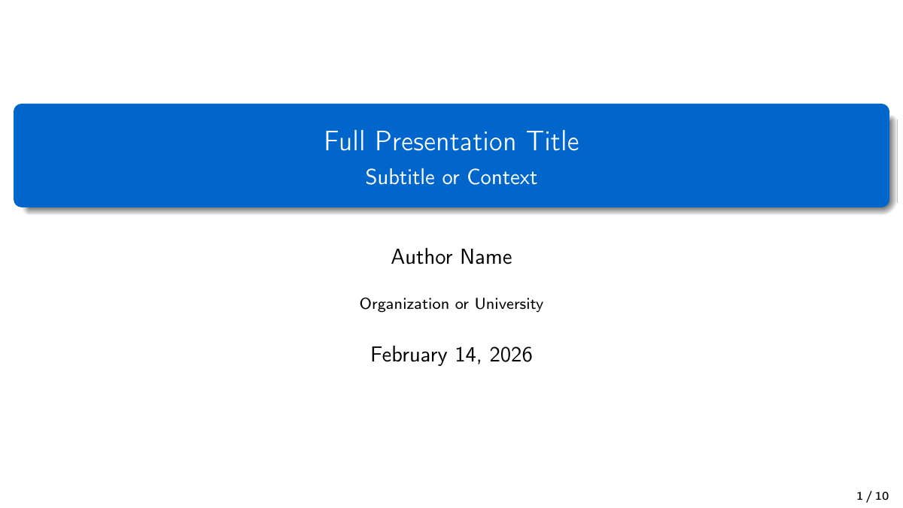

# latex-document

A Claude Code skill for creating, compiling, and converting any document to professional PDF with PNG previews. Supports resumes, reports, cover letters, invoices, academic papers, presentations, charts, tables, and PDF-to-LaTeX conversion of handwritten or printed documents.

## Features

- **11 production-ready templates** -- 5 ATS-optimized resume variants + report, cover letter, invoice, academic paper, presentation (Beamer), legacy resume
- **ATS-compatible resumes** -- researched against industry standards (Workday, Greenhouse, Taleo, iCIMS); single-column, no graphics, standard section headings
- **Charts and graphs** -- bar, line, scatter, pie charts via pgfplots; flowcharts and timelines via TikZ
- **Tables** -- colored rows, multi-row/column, booktabs, long tables spanning pages
- **PDF-to-LaTeX conversion** -- convert handwritten notes, printed reports, legal docs to LaTeX with empirically optimized scaling
- **Auto-install** -- scripts automatically install TeX Live and poppler-utils if missing
- **PNG previews** -- every compiled PDF generates page-by-page PNG previews

## Resume Templates (ATS-Optimized)

All 5 resume templates are designed to pass Applicant Tracking Systems (ATS). 98% of Fortune 500 companies use ATS to filter resumes before a human ever sees them.

| Template | Best For | ATS Score |
|---|---|---|
| Classic ATS | Finance, law, government -- maximum parse safety | 10/10 |
| Modern Professional | Tech, corporate -- good ATS + human appeal | 9/10 |
| Executive | VP/Director/C-suite -- two-page, leadership focus | 9/10 |
| Technical | Software/data/engineering -- skills-first, projects | 9/10 |
| Entry-Level | New graduates -- education-first, one page | 9/10 |

### Classic ATS


### Modern Professional


### Executive


### Technical / Engineering


### Entry-Level / Graduate


## Other Templates

### Report


### Cover Letter


### Invoice


### Academic Paper


### Presentation (Beamer)


### Charts and Graphs


## Installation

Copy the skill directory to your Claude Code skills path:

```bash
cp -r latex-document ~/.claude/skills/
```

Or install the `.skill` package if you have one.

## Usage

The skill triggers automatically when you ask Claude Code to:

- Create a resume, CV, or cover letter
- Write any document in LaTeX
- Create a PDF with tables, charts, or images
- Compile a `.tex` file
- Make a report, invoice, or presentation
- Convert a PDF to LaTeX
- Convert handwritten notes to LaTeX
- Create charts or graphs
- Create slides

### Quick Examples

**"Make me a resume"** -- Claude copies the resume template, customizes it with your info, compiles to PDF, and shows you the result.

**"Convert this PDF of my math notes to LaTeX"** -- Claude splits the PDF into images, selects the math-notes conversion profile, creates a preamble with theorem environments, and produces a clean LaTeX document.

**"Create a bar chart showing Q1-Q4 revenue"** -- Claude generates pgfplots code, compiles it, and delivers the PDF + PNG preview.

## PDF-to-LaTeX Scaling Strategy

Empirically tested on a 115-page handwritten math PDF across batch sizes 3, 5, 7, 10, and 15:

| PDF Size | Strategy | Agents | Error Rate |
|---|---|---|---|
| **1-10 pages** | Single agent | 1 | 0-2 minor (trivially fixable) |
| **11-20 pages** | Split in half | 2 | Avoids error cliff at 10+ pages |
| **21+ pages** | Batch-7 pipeline | ceil(N/7) | Optimal -- 0 errors per 7-page batch |

**Why batch-7**: Testing showed 0 errors at 7 pages, 2 structural errors at 10, and 11 catastrophic errors at 15. The error cliff between 10 and 15 pages is steep -- unclosed environments, mismatched nesting, math mode corruption.

## Conversion Profiles

| Content Type | Profile | Specialization |
|---|---|---|
| Math / science | `math-notes.md` | amsmath, amsthm, theorem environments, custom commands |
| Business | `business-document.md` | fancyhdr, tabularx, financial tables, professional colors |
| Legal | `legal-document.md` | Roman numeral sections, 1.5 spacing, footnotes, nested clauses |
| General / mixed | `general-notes.md` | Minimal packages, adaptive structure |

## Project Structure

```
latex-document/
├── SKILL.md                          # Main skill file
├── assets/
│   └── templates/                    # 11 compile-tested LaTeX templates
│       ├── resume-classic-ats.tex    # Maximum ATS compatibility
│       ├── resume-modern-professional.tex  # Clean modern design
│       ├── resume-executive.tex      # Senior/C-suite two-page
│       ├── resume-technical.tex      # Skills-first engineering
│       ├── resume-entry-level.tex    # Education-first graduate
│       ├── resume.tex                # Legacy resume (not ATS-optimized)
│       ├── report.tex
│       ├── cover-letter.tex
│       ├── invoice.tex
│       ├── academic-paper.tex
│       └── presentation.tex
├── references/
│   ├── resume-ats-guide.md           # ATS rules, LaTeX pitfalls, keywords
│   ├── charts-and-graphs.md          # pgfplots + TikZ reference
│   ├── packages.md                   # Common LaTeX packages
│   ├── pdf-conversion.md             # Full conversion pipeline
│   ├── tables-and-images.md          # Tables, images, TikZ drawings
│   └── profiles/                     # Document-type conversion profiles
│       ├── math-notes.md
│       ├── business-document.md
│       ├── legal-document.md
│       └── general-notes.md
├── scripts/
│   ├── compile_latex.sh              # Compile .tex to PDF + PNG previews
│   └── pdf_to_images.sh             # Split PDF into page images
└── examples/                         # Preview images for README
```

## Scripts

### compile_latex.sh

```bash
# Basic compile
bash scripts/compile_latex.sh document.tex

# Compile + PNG previews
bash scripts/compile_latex.sh document.tex --preview

# Compile + PNG in specific directory
bash scripts/compile_latex.sh document.tex --preview --preview-dir ./outputs
```

### pdf_to_images.sh

```bash
# Split PDF into page images
bash scripts/pdf_to_images.sh input.pdf ./output-dir

# Custom DPI and max dimension
bash scripts/pdf_to_images.sh input.pdf ./output-dir --dpi 300 --max-dim 2000
```

## License

MIT
