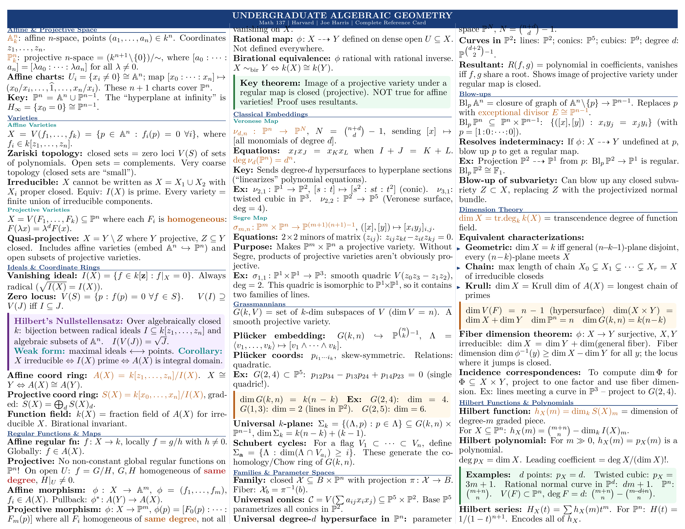
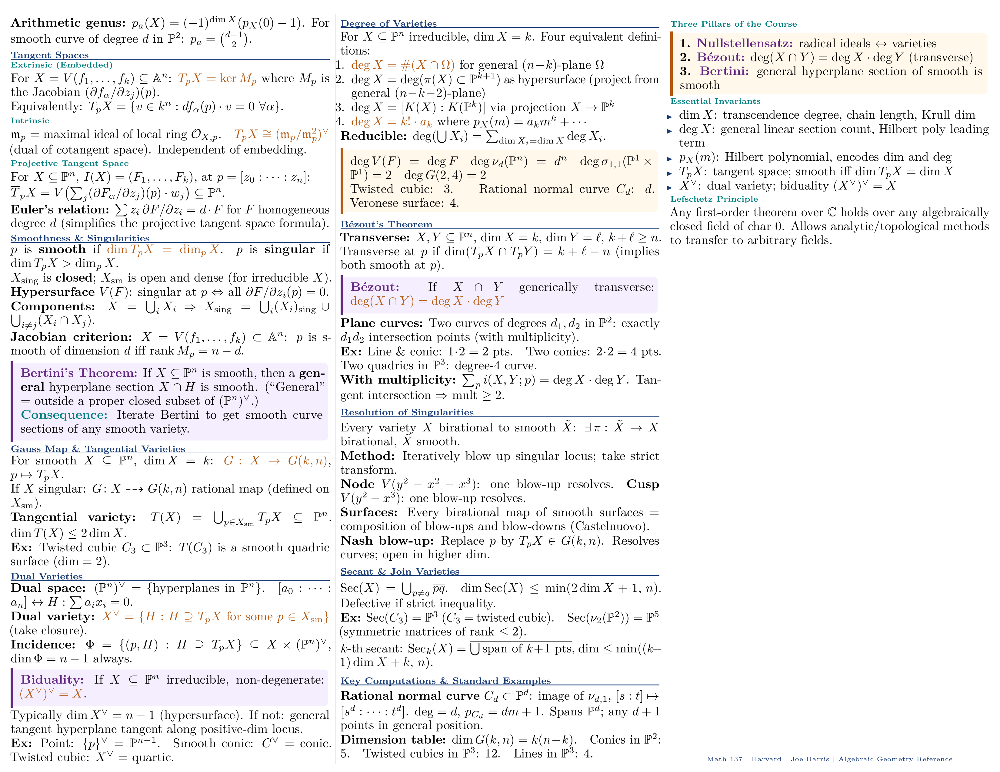

# LaTeX Document Skill

> **Say what you need in plain English -- resumes, theses, lecture notes, cheatsheets, posters, books, exams, reports, invoices -- and get a pixel-perfect PDF with zero LaTeX knowledge.**
>
> Converts handwritten notes to beautiful typeset documents. Turns 162-page textbooks into 2-page cheat sheets. Generates charts from CSV, renders Mermaid diagrams, merges and encrypts PDFs, mail-merges 500 personalized letters, diffs document versions, and auto-fetches BibTeX from DOIs. The compilation engine reads your `.tex`, picks the right engine (pdfLaTeX / XeLaTeX / LuaLaTeX), runs the exact number of passes needed, and recovers from errors -- you never touch a command line.

**27 templates · 22 automation scripts · 22 reference guides · 4 OCR conversion profiles**

---

## What Can It Actually Do?

| You say… | What happens under the hood |
|---|---|
| "Create my resume" | Selects from 5 ATS-optimized templates, compiles with `pdflatex`, generates PDF + PNG preview |
| "Convert my 80-page handwritten math notes into beautiful LaTeX" | `pdf_to_images.sh` renders at 200 DPI → batch-7 parallel OCR agents → `math-notes.md` profile generates colored `tcolorbox` theorems (blue), definitions (green), examples (orange) → `compile_latex.sh` runs multi-pass pdflatex → polished PDF with proper equations, proofs, and TikZ diagrams |
| "Turn this 162-page scan into a 2-page cheat sheet" | `pdf_to_images.sh` splits PDF → vision OCR per page → extracts key content → symbol substitution (∀, ∃, ⇒) → telegram-style compression → fits into `cheatsheet.tex` with 3-column landscape 7pt layout |
| "Build a quarterly report with charts, diagrams, and data tables" | `generate_chart.py` creates bar/line/pie charts from JSON/CSV → `csv_to_latex.py` converts data into `booktabs` tables with alternating rows → Mermaid/TikZ flowcharts compiled inline → all embedded in `report.tex` with TOC, executive summary → `compile_latex.sh` handles multi-pass compilation |
| "Add a Mermaid flowchart and Graphviz architecture diagram to my paper" | `mermaid_to_image.sh` renders `.mmd` → PNG/PDF via Puppeteer + `graphviz_to_pdf.sh` renders `.dot` → PDF via `dot` engine → images included with `\includegraphics` in your LaTeX document → compiled with proper float placement |
| "Generate 9 different charts from my sales data CSV" | `generate_chart.py` reads CSV with `--csv sales.csv` → outputs bar, line, scatter, pie, heatmap, box, histogram, area, radar charts → multi-series grouped bars, legends, colorblind-safe Tol palette, custom DPI/figsize |
| "Convert my old PDF to LaTeX" | Pages split at 200 DPI → parallel OCR agents → clean `.tex` with profile-tuned formatting (math/business/legal/general) → 0 errors per 7-page batch (empirically validated on 115-page PDF) |
| "Send personalized offer letters to 500 candidates" | `mail_merge.py` loads `template.tex` + `candidates.csv` → Jinja2 rendering with `<< >>` delimiters → 4 parallel `pdflatex` workers → `qpdf --pages` merge into single PDF |
| "Merge my 5 chapter PDFs into one book and compress it" | `pdf_merge.sh` combines ch1.pdf through ch5.pdf via `qpdf --pages` → `pdf_optimize.sh` compresses with `--linearize --recompress-flate --object-streams=generate` → shows % size reduction |
| "Extract odd pages from my thesis and encrypt the result" | `pdf_extract_pages.sh --pages odd` extracts via qpdf → `pdf_encrypt.sh` applies AES-256 with `--restrict-print --restrict-modify` → password-protected PDF with selected pages |
| "What changed between v1 and v2 of my thesis?" | `latex_diff.sh` runs `latexdiff --type=UNDERLINE --allow-spaces old.tex new.tex` → `compile_latex.sh` runs 2-pass pdflatex → highlighted change-tracked PDF with additions in blue, deletions in red |
| "Make a NeurIPS poster" | Interactive: asks orientation → layout archetype → color scheme → generates A0 `tikzposter` with correct dimensions, QR codes, `tikzfigure` environments |
| "Create a calculus final exam with answer key" | `exam` class with `\printanswers` toggle, grading table via `\gradetable`, 6 question types (MCQ, T/F, fill-blank, matching, short, essay) |
| "Convert my Markdown thesis to LaTeX with bibliography" | `convert_document.sh` calls Pandoc with `--bibliography refs.bib --csl ieee.csl --standalone --toc` → auto-detects input/output format from extensions → full LaTeX with citations |
| "Turn this CSV into a professional LaTeX table" | `csv_to_latex.py` auto-detects numeric columns (right-aligns them), escapes LaTeX specials (`&`, `%`, `$`), applies `booktabs` style with `--alternating-rows --caption --label` |
| "Fetch BibTeX for these 3 DOIs and check my citations" | `fetch_bibtex.sh` hits `doi.org` with `Accept: application/x-bibtex` header → appends to `.bib` → `latex_citation_extract.sh --check` cross-refs every `\cite{}` key against the `.bib` file → reports missing/unused entries |
| "Check if my paper is ready to submit" | `latex_package_check.sh` verifies all `\usepackage` via `kpsewhich` → `latex_citation_extract.sh --check` cross-refs `\cite{}` keys against `.bib` → `latex_analyze.sh` counts figures/tables/equations/unreferenced labels → `latex_lint.sh` runs chktex for style issues |
| "Create a fillable PDF application form" | `fillable-form.tex` with `hyperref` form fields → text inputs, checkboxes, radio buttons, dropdowns, push buttons → compiled to interactive PDF (works in Adobe Reader/Acrobat) |
| "Password-protect this report" | `pdf_encrypt.sh` calls `qpdf --encrypt <pw> <pw> 256 --print=none --modify=none -- input.pdf output.pdf` |

---

## Killer Features

### 1. Smart Compilation Engine (`compile_latex.sh` -- 525 lines)

Not a wrapper around `pdflatex`. It's an intelligent build system that reads your document and makes decisions:

**Auto-detection logic:**
```
Document contains \usepackage{fontspec} or \usepackage{xeCJK}  →  xelatex
Document contains \usepackage{luacode} or \directlua            →  lualatex
Otherwise                                                        →  pdflatex

Document contains \bibliography{}                                →  bibtex
Document contains \addbibresource{}                              →  biber

Document contains \makeindex                                     →  runs makeindex
Document contains \makeglossaries                                →  runs makeglossaries
```

**Multi-pass compilation:** Runs the engine up to 3 times, checking for "Rerun to get cross-references right" each pass. Bibtex/biber runs between passes 1 and 2.

**Auto-fix mode** (`--auto-fix`):
| What it fixes | How |
|---|---|
| Naked `\begin{figure}` without placement | Injects `[htbp]` -- the #1 LaTeX beginner complaint |
| Naked `\begin{table}` without placement | Same `[htbp]` injection |
| Overfull hbox warnings | Adds `\usepackage{microtype}` to preamble |

**Error translation** -- parses `.log` and translates into actionable English:
| Raw LaTeX Error | What the script tells you |
|---|---|
| `Missing $ inserted` | "Math symbol used outside `$...$` -- wrap it in dollar signs" |
| `Undefined control sequence \xyz` | "Unknown command `\xyz` -- check spelling or add the right `\usepackage`" |
| `Too many }'s` | "Extra closing brace -- count your `{` and `}` pairs" |
| `File 'foo.sty' not found` | "Missing package `foo` -- install with `tlmgr install foo`" |

**Preview generation:** After compilation, runs `pdftoppm -png -r 200` on the output PDF and resizes to ≤2000px using `mogrify` for embedding.

```bash
bash scripts/compile_latex.sh document.tex --preview --auto-fix
```

---

### 2. PDF-to-LaTeX Reconstruction (Vision OCR Pipeline)

Convert **any PDF** -- scanned textbook, handwritten notes, printed report -- into compilable LaTeX.

**Pipeline:**
1. `pdf_to_images.sh` renders pages at 200 DPI using `pdftoppm`, zero-pads filenames (`page-001.png`, `page-002.png`), resizes to ≤2000px for API limits
2. Vision model reads each page image
3. Generates `.tex` with profile-appropriate formatting

**Scaling strategy** (empirically validated -- tested on 115-page handwritten math notes):
| PDF Size | Strategy | Expected Errors |
|---|---|---|
| 1-10 pages | Single agent processes all pages | 0-2 minor errors |
| 11-20 pages | Split into 2 batches of ~10 | Near-zero per batch |
| 21+ pages | Batch-7 pipeline with parallel agents | 0 errors per 7-page batch |

**4 conversion profiles** (in `references/profiles/`):
| Profile | Tuned For |
|---|---|
| `math-notes.md` | Equations, theorems, proofs. "Beautiful mode" uses colored `tcolorbox` environments (blue theorems, green definitions, orange examples) |
| `business-document.md` | Reports, financials, tables, bullet lists |
| `legal-document.md` | Numbered paragraphs, statutory references, legal citation formatting |
| `general-notes.md` | Handwritten notes, mixed media, letters |

---

### 3. PDF-to-Cheat Sheet Pipeline

Condense entire textbooks into 2-page reference cards. Three templates with different density strategies:

| Template | Layout | Font Size | Columns | Best For |
|---|---|---|---|---|
| `cheatsheet.tex` | Landscape A4 | 7pt | 3 | Course reference, concept summaries |
| `cheatsheet-exam.tex` | Portrait A4 | 6pt | 2 | Exam formula sheets (B&W-safe) |
| `cheatsheet-code.tex` | Landscape A4 | 7pt | 4 | Programming references, CLI commands |

**Density techniques used:**
- Symbol substitution (∀ instead of "for all", ∃ instead of "there exists")
- Horizontal formula stacking (multiple formulas on one line with `\quad` separators)
- Telegram-style text (articles and filler words stripped)
- Content prioritization: formulas 60-70% → procedures 15-20% → constants 10-15% → definitions 5-10%
- Compile-and-verify loop to fit exact page budget

---

### 4. Mail Merge (`mail_merge.py` -- 574 lines)

Generate N personalized documents from one template + one data source:

```bash
python3 scripts/mail_merge.py template.tex contacts.csv \
    --output-dir ./letters --workers 4 --merge --merge-name all_letters.pdf
```

**Two templating modes:**

| Mode | Syntax | Features |
|---|---|---|
| **Simple** (default) | `{{first_name}}`, `{{company}}` | Auto-escapes `&`, `%`, `$`, `#`, `_`, `{`, `}`, `~`, `^`, `\` for LaTeX safety |
| **Jinja2** (`--jinja2`) | `<< first_name >>`, `<% if ... %>` | Conditionals, loops, filters. Delimiters chosen to avoid LaTeX `{}` conflicts. `|escape_latex` filter available |

**Technical details:**
- Data sources: CSV, JSON, JSONL
- Uses `concurrent.futures.ProcessPoolExecutor` for parallel compilation
- Each document compiled independently (crash isolation)
- Final merge via `qpdf --pages` or `pdfunite`
- Custom naming: `--name-field last_name --prefix "offer_letter"` → `offer_letter_Smith.pdf`

---

### 5. Version Diffing (`latex_diff.sh` -- 409 lines)

A full-featured `latexdiff` wrapper with git integration:

```bash
# Compare two files directly
bash scripts/latex_diff.sh paper_v1.tex paper_v2.tex --compile --preview

# Compare against a git commit
bash scripts/latex_diff.sh paper.tex --git-rev HEAD~3 --compile

# Compare between two git tags
bash scripts/latex_diff.sh paper.tex --git-rev v1.0 --compile --type CULINECHBAR

# Multi-file document with \input/\include
bash scripts/latex_diff.sh old/main.tex new/main.tex --flatten --compile
```

**8 markup types:**
| Type | Visual Effect |
|---|---|
| `UNDERLINE` (default) | Additions underlined in blue, deletions struck through in red |
| `CTRADITIONAL` | Additions in blue text, deletions in red with strikethrough |
| `CFONT` | Additions in sans-serif blue, deletions in tiny red |
| `CHANGEBAR` | Change bars in margin only, no inline markup |
| `CCHANGEBAR` | Change bars + color changes |
| `CULINECHBAR` | Underline + change bars (most comprehensive) |
| `FONTSTRIKE` | Font change + strikethrough |
| `INVISIBLE` | No visible markup (for testing) |

**Git integration:** Extracts old version via `git show <rev>:<path>`, writes to temp file, diffs against current working copy. Supports rev specs like `HEAD~1`, `v1.0`, branch names.

**Custom colors:** `--color-add "green!70!black" --color-del "red!80!black"` injects `\DIFaddcolor`/`\DIFdelcolor` overrides.

---

### 6. BibTeX Auto-Fetch (`fetch_bibtex.sh` -- 251 lines)

Download BibTeX entries from DOIs or arXiv IDs with zero manual work:

```bash
# From DOI -- hits doi.org with Accept: application/x-bibtex header
bash scripts/fetch_bibtex.sh 10.1038/nature12373

# From arXiv -- parses Atom XML from export.arxiv.org/api
bash scripts/fetch_bibtex.sh 2301.07041

# Multiple at once, append to existing .bib
bash scripts/fetch_bibtex.sh 10.1145/3290605.3300608 1906.08237 \
    --append --output references.bib
```

Auto-detects identifier type: `10.xxxx/...` → DOI, `YYMM.NNNNN` → arXiv. Strips `arXiv:` prefix if present.

---

## Visual Elements

### Charts & Graphs (`generate_chart.py` -- 459 lines)

9 chart types from JSON or CSV data, output as PNG or PDF:

```bash
python3 scripts/generate_chart.py bar \
    --data '{"x":["Q1","Q2","Q3","Q4"],"y":[120,150,180,210]}' \
    --output chart.png --title "Revenue" --style ggplot --figsize 10 6
```

| Chart Type | Multi-Series | Notes |
|---|---|---|
| `bar` | Yes (grouped) | Horizontal with `--horizontal` |
| `line` | Yes | Markers, grid |
| `scatter` | Yes | |
| `pie` | No | Autopct, explode slices |
| `heatmap` | No | Annotated cells, custom colormap |
| `box` | Yes | Statistical distribution |
| `histogram` | Yes | Custom bins |
| `area` | Yes | Stacked with alpha |
| `radar` | Yes | Spider/star chart |

**Inline charts** can also be created directly in LaTeX using `pgfplots` -- templates include examples.

### Tables (`csv_to_latex.py` -- 364 lines)

```bash
python3 scripts/csv_to_latex.py data.csv --style booktabs --alternating-rows \
    --caption "Experimental Results" --label tab:results --max-rows 50
```

| Style | Look |
|---|---|
| `booktabs` | Professional -- `\toprule`, `\midrule`, `\bottomrule` |
| `grid` | Full borders on all cells |
| `simple` | Horizontal rules only |
| `plain` | No rules at all |

Auto-detects column alignment (right-aligns numeric columns). Handles LaTeX special character escaping.

### Diagrams -- 4 Rendering Pipelines

| Tool | Script | Input | Output | Batch Mode |
|---|---|---|---|---|
| **TikZ** | (compiled inline) | `.tex` | PDF | -- |
| **Mermaid** | `mermaid_to_image.sh` | `.mmd` | PNG/PDF | No |
| **Graphviz** | `graphviz_to_pdf.sh` | `.dot` | PDF/PNG | Yes (whole directory) |
| **PlantUML** | `plantuml_to_pdf.sh` | `.puml` | PDF/PNG/SVG | Yes (whole directory) |

**Graphviz** supports 6 layout engines: `dot` (hierarchical), `neato` (spring model), `circo` (circular), `fdp` (force-directed), `twopi` (radial), `sfdp` (scalable force-directed).

**Mermaid** uses `npx @mermaid-js/mermaid-cli` with Puppeteer in `--no-sandbox` mode. Supports themes: `default`, `dark`, `forest`, `neutral`.

**PlantUML** auto-downloads `plantuml.jar` to `~/.local/share/plantuml/` if not installed via package manager. Requires Java.

---

## Template Gallery -- 27 Templates

### Resumes -- 5 ATS-Optimized + 1 Legacy

All 5 modern templates designed to pass Applicant Tracking Systems (no columns, no tables for layout, no graphics in header, machine-readable text):

| Template | Target Role | Key Design Choices |
|---|---|---|
| `resume-classic-ats.tex` | Finance, law, government | Single-column, minimal styling, maximum parsability |
| `resume-modern-professional.tex` | Tech, corporate | Clean sections, subtle color accents |
| `resume-executive.tex` | VP / Director / C-suite | Multi-page, executive summary section |
| `resume-technical.tex` | Software, data, engineering | Skills matrix, project highlights |
| `resume-entry-level.tex` | New graduates | Education-first, coursework, activities |
| `resume.tex` (legacy) | Regions requiring photos | Photo area -- **not** ATS-compatible |

| | | | |
|---|---|---|---|
|  |  |  |  |
| Classic ATS | Modern Professional | Executive (p1) | Executive (p2) |
|  |  | | |
| Technical | Entry-Level | | |

---

### Academic Documents

#### Thesis / Dissertation -- Full book-class, 38+ pages

Palatino fonts, `microtype`, `mathtools`, `cleveref`. Front matter (title, declaration, abstract, acknowledgments, TOC), multiple chapters, appendices, bibliography with `biblatex`/biber. `\geometry{bindingoffset=1.5cm}` for professional printing.

| | | | |
|---|---|---|---|
|  |  |  |  |
| Title Page | Table of Contents | Literature Review | TikZ Diagram |
|  |  |  |  |
| Results | Charts | Chapter Content | Bibliography |

#### Academic Paper -- 11 pages, arXiv-compatible

Times fonts, colorblind-safe Tol palette, multi-author affiliations via `authblk`, `siunitx` for consistent units, algorithm environments, theorem/proof. `\pdfoutput=1` for arXiv submission.

| | | | |
|---|---|---|---|
|  |  |  |  |
| Title & Abstract | Tables + Charts | Ablation Study | References |

#### Lecture Notes (Beautiful Mode) -- Color-coded theorem environments

`lecture-notes.tex`: Palatino fonts, `tcolorbox` with semantic colors -- blue theorems, green definitions, orange examples, purple remarks. TikZ graph theory macros, custom math operators (`\E`, `\Var`, `\Cov`).

| | | | |
|---|---|---|---|
|  |  |  |  |
|  |  |  |  |

#### Academic CV -- Multi-page with publications, grants, teaching

Numbered publications ([J1], [C1], [W1]), grants with dollar amounts, student advising (current + graduated), professional service, invited talks. ORCID and Google Scholar links.

| | | | |
|---|---|---|---|
|  |  |  |  |

#### Homework / Assignment -- Solution toggle

Custom `problem`/`solution` environments, code listings (Python, Java, C++, Matlab), honor code section. Toggle solutions globally with `\showsolutionstrue`/`\showsolutionsfalse`.

#### Lab Report -- STEM lab writeups

`siunitx` for uncertainties and SI units, `pgfplots` for data with error bars, structured sections: abstract → theory → procedure → data → analysis → discussion → conclusion.

---

### Scientific Posters -- `tikzposter` class

Interactive workflow asks: conference → orientation → layout → color scheme.

| Layout | Usage | Description |
|---|---|---|
| Traditional Column | ~70% of posters | 2-column (portrait) or 3-column (landscape) |
| #BetterPoster | ~10% (growing) | Central billboard with ONE key finding at 60-80pt |
| Visual-Heavy | ~15% | Large central figure consuming 40-50% of space |

Conference presets: NeurIPS, ICML, CVPR, ICLR (main + workshop sizes).

| Portrait A0 | Landscape A0 |
|---|---|
|  |  |

---

### Book -- Full-Length Publishing Template

`book` class, 37+ pages. Palatino fonts, `lettrine` drop caps, `imakeidx` for indexing. Structure: half-title → full title → copyright page (ISBN slot) → dedication → preface → acknowledgments → TOC → parts → chapters with epigraphs → appendices → bibliography → index → colophon.

| | | | | |
|---|---|---|---|---|
|  |  |  |  |  |
| Half Title | Full Title | Copyright | TOC | Preface |
|  |  |  |  |  |
| Acknowledgments | Part I | Ch 1: Drop Caps | Definitions & Theorems | Notation & Summary |

---

### Exam / Quiz -- `exam` class

6 question types (multiple choice, true/false, fill-in-blank, matching, short answer, essay). Point values per question, `\gradetable[h][questions]` for grading grid. `\printanswers` / `\noprintanswers` toggles solution visibility.

| | | | | | |
|---|---|---|---|---|---|
|  |  |  |  |  |  |

---

### Cheat Sheets -- 3 Variants

| Template | Columns | Font | Orientation |
|---|---|---|---|
| `cheatsheet.tex` | 3 | 7pt | Landscape |
| `cheatsheet-exam.tex` | 2 | 6pt | Portrait |
| `cheatsheet-code.tex` | 4 | 7pt | Landscape |

**Example: Algebraic Geometry (162 pages → 2 pages)**

| | |
|---|---|
|  |  |
| Page 1 -- Affine/Projective Space, Varieties, Morphisms | Page 2 -- Sheaves, Schemes, Cohomology, Key Examples |

---

### Interactive / Dynamic Templates

| Template | What It Does |
|---|---|
| `fillable-form.tex` | PDF form fields: text inputs, checkboxes, radio buttons, dropdowns, push buttons (via `hyperref`) |
| `conditional-document.tex` | 12 `etoolbox` toggles (showTOC, isDraft, isConfidential...), 3 visual profiles, CLI-overridable with `\newcommand` |
| `mail-merge-letter.tex` | Template for `mail_merge.py` -- `{{name}}` placeholders |

---

### Business Documents

| | | |
|---|---|---|
|  |  |  |
| `letter.tex` -- Business letter | `cover-letter.tex` -- Job application | `invoice.tex` -- Professional invoice |

---

### Presentation (`presentation.tex`) -- Beamer 16:9

Custom theme, widescreen aspect ratio, title/section/content/two-column/code/image/thank-you frame types.

| | | | | |
|---|---|---|---|---|
|  |  |  |  |  |
|  |  |  |  |  |

---

### Report (`report.tex`)

Executive summary, findings, recommendations with TOC, pgfplots bar charts, TikZ flowcharts, colored data tables.

| | | | |
|---|---|---|---|
|  |  |  |  |

---

## Format Conversion (`convert_document.sh` -- 316 lines)

Pandoc wrapper with auto-detection of input/output formats from file extensions:

```
Markdown <-> LaTeX <-> DOCX <-> HTML <-> PDF
```

```bash
# Markdown to LaTeX
bash scripts/convert_document.sh notes.md notes.tex --standalone --toc

# DOCX to LaTeX with bibliography
bash scripts/convert_document.sh manuscript.docx manuscript.tex --bibliography refs.bib --csl ieee.csl

# LaTeX to PDF (uses lualatex if available for Unicode)
bash scripts/convert_document.sh paper.tex paper.pdf
```

Auto-selects `--standalone` for most output formats. Adds `--mathjax` for HTML output. Prefers `lualatex` PDF engine for Unicode support when available.

---

## PDF Utilities

All 4 scripts use `qpdf` (auto-installed if missing via `install_deps.sh`):

| Script | What It Does | Key Flags |
|---|---|---|
| `pdf_encrypt.sh` | AES-256 password protection | `--restrict-print`, `--restrict-copy`, `--restrict-modify`, `--owner-password` |
| `pdf_merge.sh` | Combine 2+ PDFs into one | `--output combined.pdf` |
| `pdf_optimize.sh` | Compress + linearize for web | `--linearize`, `--compress-streams=y`, `--recompress-flate`, `--object-streams=generate` |
| `pdf_extract_pages.sh` | Extract page ranges | `--pages 1-10`, `--pages odd`, `--pages even`, `--pages last:3`, `--pages 1,3,5-8` |

```bash
# Encrypt with restrictions
bash scripts/pdf_encrypt.sh report.pdf --user-password secret --restrict-print --restrict-modify

# Merge chapters into book
bash scripts/pdf_merge.sh ch1.pdf ch2.pdf ch3.pdf --output book.pdf

# Compress for email (shows % reduction)
bash scripts/pdf_optimize.sh large.pdf --output small.pdf

# Extract appendix
bash scripts/pdf_extract_pages.sh thesis.pdf --pages last:3 --output appendix.pdf
```

---

## LaTeX Quality & Analysis Tools

| Script | Lines | What It Does | Key Details |
|---|---|---|---|
| `latex_lint.sh` | 173 | Run `chktex` with colored output | `--strict` treats warnings as errors |
| `latex_wordcount.sh` | 149 | Word count via `detex` | `--detailed` adds figures/tables/equations/citations/section count |
| `latex_analyze.sh` | 216 | Comprehensive document analysis | Checks: missing labels on figures/tables, unreferenced `\label{}`, TODO/FIXME comments, double spaces |
| `latex_package_check.sh` | 265 | Pre-flight `\usepackage` verification | Uses `kpsewhich` for each `.sty`, `--install` auto-installs via `tlmgr`, also checks `\documentclass` |
| `latex_citation_extract.sh` | 342 | Citation analysis | Extracts all `\cite*{}` variants, counts per key, `--check` cross-refs against `.bib`, `--format json` for programmatic use |
| `fetch_bibtex.sh` | 251 | Auto-download BibTeX entries | DOIs (via `doi.org` content negotiation) and arXiv IDs (via Atom XML API), `--append` mode |
| `validate_latex.py` | 426 | Python syntax validator for batch files | 6 checks: balanced environments, undefined commands, floats in tcolorbox, TikZ outside tikzpicture, missing node labels, stray ampersands |

---

## Multi-Language Support

The compile script auto-selects the engine based on package imports in your document:

| Language Family | Package | Auto-Selected Engine |
|---|---|---|
| European (French, German, Spanish...) | `babel` | pdfLaTeX |
| CJK (Chinese, Japanese, Korean) | `xeCJK` | XeLaTeX |
| RTL (Arabic, Hebrew, Farsi) | `polyglossia` | XeLaTeX |
| Cyrillic (Russian, Ukrainian) | `babel` or `polyglossia` | pdfLaTeX or XeLaTeX |

---

## Cross-Platform Dependency System (`install_deps.sh` -- 237 lines)

All scripts source this shared library for dependency management. It provides:

- **Package manager detection:** `apt-get` → `brew` → `dnf` → `apk` → `pacman`
- **Logical package mapping:** `install_packages texlive poppler imagemagick` resolves to platform-specific package names (e.g., `texlive` → `texlive-latex-base texlive-latex-extra ...` on apt, `--cask basictex` on brew)
- **Deduplication:** Removes duplicate packages before installing
- **Privileged execution:** Uses `sudo` if available, direct execution otherwise
- **Post-install hooks:** Adds `/Library/TeX/texbin` to PATH on macOS after BasicTeX install

---

## Reference Documentation

22 reference guides in `references/`:

<details>
<summary>Full index</summary>

| Guide | Covers |
|---|---|
| `resume-ats-guide.md` | ATS parsing rules, keyword optimization, formatting do's and don'ts |
| `poster-design-guide.md` | Conference presets, #BetterPoster layout, typography at poster scale |
| `bibliography-guide.md` | BibTeX vs biblatex, `\cite` variants, CSL styles |
| `advanced-features.md` | Watermarks, landscape sections, multi-language, algorithms, siunitx |
| `charts-and-graphs.md` | pgfplots patterns (line, bar, scatter, pie, 3D) |
| `python-charts.md` | matplotlib via `generate_chart.py` -- all 9 types, CSV input |
| `mermaid-diagrams.md` | Flowcharts, sequence, class, ER, Gantt, pie, mindmap |
| `format-conversion.md` | Pandoc pipeline, custom templates, bibliography integration |
| `pdf-conversion.md` | Full PDF-to-LaTeX pipeline, batch processing, profiles |
| `tables-and-images.md` | Colored rows, multi-row/column, booktabs, subfigures |
| `interactive-features.md` | Forms, conditional content, mail merge, diffing |
| `packages.md` | Common LaTeX package reference |
| `visual-packages.md` | 24 TikZ/visualization packages with examples |
| `graphviz-plantuml.md` | Graphviz & PlantUML workflows and examples |
| `pdf-extraction-prompts.md` | LLM prompts for PDF-to-cheatsheet conversion |
| `cheatsheet-guide.md` | Density optimization, compression techniques |
| `debugging-guide.md` | 20 common errors explained, .log file reading |
| `accessibility-guide.md` | PDF/A, PDF/UA, tagged PDFs, WCAG compliance |
| `beamer-guide.md` | Themes, overlays, code slides, handout mode |
| `font-guide.md` | Font families, fontspec, fontawesome5 icons |
| `collaboration-guide.md` | Git workflows, GitHub Actions, Docker, CI/CD for LaTeX |
| `profiles/` | 4 OCR conversion profiles (math, business, legal, general) |

</details>

---

## Installation

```bash
# Install as a Claude Code skill
cp -r latex-document ~/.claude/skills/

# Or run full dependency setup
bash setup.sh            # Installs: TeX Live, Poppler, ImageMagick, Pandoc, Python deps
bash setup.sh --check    # Verify everything is installed
```

**System dependencies** (auto-installed by `setup.sh` on Debian/macOS/Fedora/Alpine/Arch):
- **TeX Live** -- pdflatex, xelatex, lualatex, biber, makeindex, makeglossaries
- **Poppler** -- `pdftoppm` for PNG previews, `pdfinfo` for page counts
- **ImageMagick** -- `mogrify` for image resizing, `identify` for dimensions
- **Pandoc** -- format conversion engine
- **Python 3** + `matplotlib`, `numpy`, `pandas`
- **qpdf** -- PDF encryption, merging, optimization, page extraction

**Optional:**
- **Node.js 18+** -- for Mermaid diagram conversion via `npx @mermaid-js/mermaid-cli`
- **Java** -- for PlantUML rendering
- **Graphviz** -- for `.dot` diagram rendering
- **chktex** -- for LaTeX linting
- **latexdiff** -- for version diffing

---

## Project Structure

```
latex-document/
├── SKILL.md                              # Skill definition (1,340 lines)
├── README.md                             # This file
├── setup.sh                              # One-click installer (apt/brew/dnf/apk/pacman)
├── requirements.txt                      # Python: matplotlib, numpy, pandas
│
├── assets/templates/                     # 27 production-tested .tex templates
│   ├── resume-*.tex (x6)                 #   5 ATS-optimized + 1 legacy with photo
│   ├── thesis.tex                        #   PhD/Masters dissertation
│   ├── academic-paper.tex                #   arXiv-compatible research paper
│   ├── academic-cv.tex                   #   Multi-page academic CV
│   ├── lecture-notes.tex                 #   Color-coded theorem environments
│   ├── homework.tex                      #   Homework with solution toggle
│   ├── lab-report.tex                    #   STEM lab writeup with siunitx
│   ├── book.tex                          #   Full book (parts, chapters, index)
│   ├── poster.tex, poster-landscape.tex  #   A0 conference posters (tikzposter)
│   ├── exam.tex                          #   Exam/quiz (exam class, 6 question types)
│   ├── cheatsheet*.tex (x3)              #   General, exam, code reference cards
│   ├── fillable-form.tex                 #   Interactive PDF form (hyperref)
│   ├── conditional-document.tex          #   etoolbox toggle-driven content
│   ├── mail-merge-letter.tex             #   Personalized letter template
│   ├── letter.tex, cover-letter.tex      #   Business + job application letters
│   ├── invoice.tex                       #   Professional invoice
│   ├── report.tex                        #   Business report with charts
│   ├── presentation.tex                  #   Beamer slides (16:9)
│   └── references.bib                    #   Example bibliography
│
├── scripts/                              # 22 automation scripts
│   ├── compile_latex.sh          (525)   #   Core: .tex → PDF + PNG
│   ├── mail_merge.py             (574)   #   Template + data → N PDFs
│   ├── generate_chart.py         (459)   #   9 chart types (matplotlib)
│   ├── validate_latex.py         (426)   #   6-check syntax validator
│   ├── latex_diff.sh             (409)   #   latexdiff + git integration
│   ├── csv_to_latex.py           (364)   #   CSV → LaTeX tables (4 styles)
│   ├── plantuml_to_pdf.sh        (362)   #   .puml → PDF/PNG/SVG
│   ├── latex_citation_extract.sh (342)   #   Citation analysis + bib cross-ref
│   ├── convert_document.sh       (316)   #   Pandoc format conversion
│   ├── latex_package_check.sh    (265)   #   Pre-flight package checker
│   ├── fetch_bibtex.sh           (251)   #   DOI/arXiv → BibTeX
│   ├── graphviz_to_pdf.sh        (250)   #   .dot → PDF/PNG (6 engines)
│   ├── pdf_extract_pages.sh      (247)   #   Extract page ranges
│   ├── install_deps.sh           (237)   #   Cross-platform dependency lib
│   ├── latex_analyze.sh          (216)   #   Document statistics + issues
│   ├── pdf_encrypt.sh            (215)   #   AES-256 PDF encryption
│   ├── mermaid_to_image.sh       (178)   #   .mmd → PNG/PDF
│   ├── latex_lint.sh             (173)   #   chktex with colored output
│   ├── pdf_optimize.sh           (157)   #   Compress + linearize
│   ├── latex_wordcount.sh        (149)   #   Word count via detex
│   ├── pdf_to_images.sh          (144)   #   PDF → page images (OCR pipeline)
│   └── pdf_merge.sh              (136)   #   Merge multiple PDFs
│
├── references/                           # 22 deep-dive reference guides
│   ├── *.md (x22)
│   └── profiles/ (x4)                    #   OCR profiles: math, business, legal, general
│
└── examples/                             # 78 PNG preview images of compiled templates
```

---

## License

MIT
