# Graphviz and PlantUML in LaTeX

## Overview

**Graphviz** and **PlantUML** are external diagramming tools that generate high-quality diagrams from text descriptions. Unlike TikZ or pgfplots (which are native LaTeX), these tools process text files externally to create PDF or PNG images that are then included in LaTeX documents via `\includegraphics`.

### Why Use External Diagram Tools?

**Advantages:**
- **Automatic layout** - no manual positioning of nodes
- **Text-based** - version control friendly, easy to diff
- **Fast prototyping** - quick to write and iterate
- **Specialized strengths** - each tool excels at specific diagram types
- **No LaTeX expertise required** - accessible to non-LaTeX users

**Disadvantages:**
- **Extra build step** - requires preprocessing before LaTeX compilation
- **External dependency** - need separate tools installed
- **Less LaTeX integration** - included as images, not native graphics
- **Limited typography** - can't use LaTeX math directly in diagrams (unless using dot2tex)

### Typical Workflow

```
1. Write diagram in .dot or .puml file
   ↓
2. Convert to PDF/PNG using command-line tool
   ↓
3. Include in LaTeX with \includegraphics
   ↓
4. Compile LaTeX document
```

---

## Graphviz

### What is Graphviz?

**Graphviz** is a graph visualization toolkit that automatically lays out nodes and edges. It excels at:
- **Directed/undirected graphs** - network topologies, dependencies
- **State machines** - FSMs, statecharts
- **Flowcharts** - process flows, decision trees
- **Data structures** - trees, linked lists
- **Software architecture** - module dependencies, call graphs

### Layout Engines

Graphviz provides multiple layout engines for different graph types:

| Engine | Best For | Layout Style |
|--------|----------|-------------|
| **dot** | Directed graphs, hierarchies | Top-to-bottom or left-to-right |
| **neato** | Undirected graphs | Spring model (force-directed) |
| **circo** | Circular layouts | Nodes in circles |
| **fdp** | Undirected graphs | Force-directed placement |
| **twopi** | Radial layouts | Nodes radiate from center |
| **sfdp** | Large graphs (1000+ nodes) | Multiscale force-directed |

### Installation

```bash
# Debian/Ubuntu
sudo apt-get install graphviz

# macOS
brew install graphviz

# Fedora/RHEL
sudo dnf install graphviz

# Alpine
sudo apk add graphviz

# Arch
sudo pacman -S graphviz
```

Or use the helper script (auto-installs):
```bash
graphviz_to_pdf.sh diagram.dot
```

### LaTeX Packages

```latex
\usepackage{graphicx}  % For \includegraphics
\usepackage{float}     % For H placement specifier
```

---

## Graphviz Examples

### Directed Graph (dot)

**File: `dependency_graph.dot`**
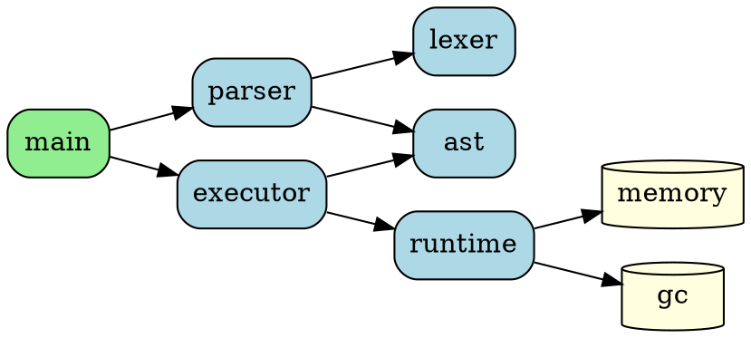

**Convert to PDF:**
```bash
dot -Tpdf dependency_graph.dot -o dependency_graph.pdf
# Or use helper script
graphviz_to_pdf.sh dependency_graph.dot
```

**LaTeX Integration:**
```latex
\begin{figure}[H]
    \centering
    \includegraphics[width=0.8\textwidth]{dependency_graph.pdf}
    \caption{Module dependency graph showing compilation pipeline}
    \label{fig:dependencies}
\end{figure}
```

### Undirected Graph (neato)

**File: `network_topology.dot`**
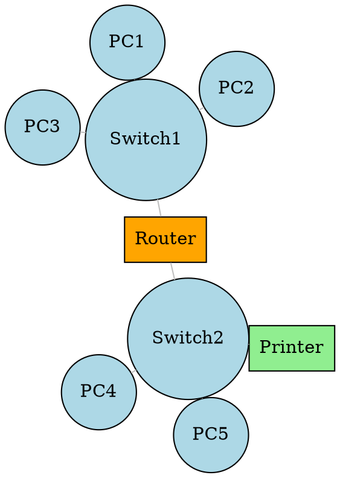

**Convert:**
```bash
neato -Tpdf network_topology.dot -o network_topology.pdf
# Or
graphviz_to_pdf.sh network_topology.dot --engine neato
```

### State Machine

**File: `order_states.dot`**
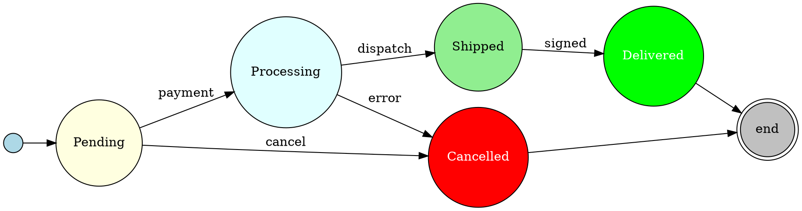

**LaTeX:**
```latex
\begin{figure}[H]
    \centering
    \includegraphics[width=\textwidth]{order_states.pdf}
    \caption{Order lifecycle state machine}
    \label{fig:order-fsm}
\end{figure}
```

### Record Nodes (Data Structures)

**File: `linked_list.dot`**
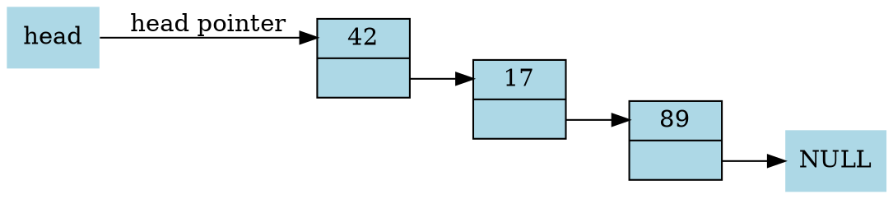

### Cluster (Subgraphs)

**File: `architecture.dot`**
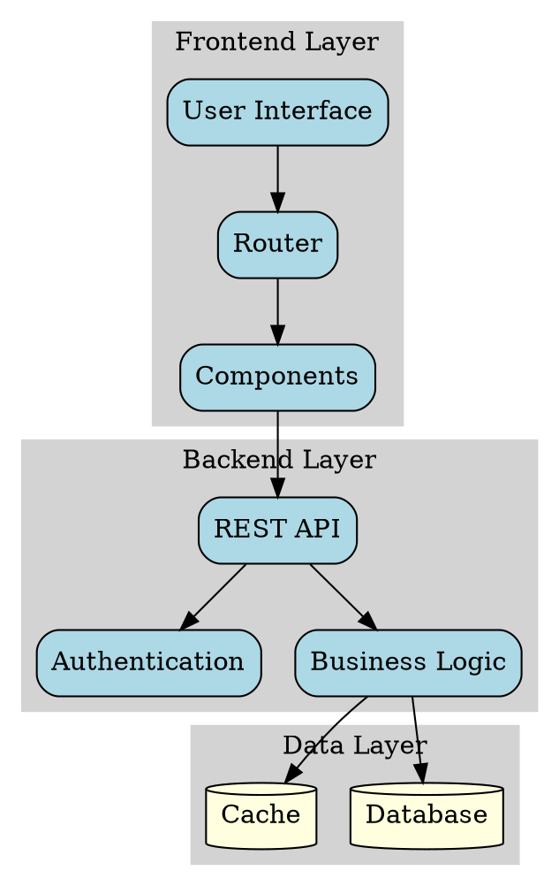

---

## Graphviz Attributes

### Common Node Shapes

```dot
node [shape=box];          // Rectangle
node [shape=circle];       // Circle
node [shape=ellipse];      // Ellipse (default)
node [shape=diamond];      // Diamond (decisions)
node [shape=parallelogram]; // Input/Output
node [shape=cylinder];     // Database
node [shape=folder];       // Directory
node [shape=note];         // Document
node [shape=component];    // Component box
```

### Colors and Styles

```dot
node [style=filled, fillcolor=lightblue];
node [style="rounded,filled", fillcolor=lightgreen];
node [color=red, penwidth=2.0];
edge [color=blue, style=dashed];
edge [label="label text", fontcolor=red];
```

### Direction

```dot
rankdir=TB;  // Top to Bottom (default)
rankdir=LR;  // Left to Right
rankdir=BT;  // Bottom to Top
rankdir=RL;  // Right to Left
```

---

## Converting Graphviz to PDF/PNG

### Command-Line Usage

```bash
# Basic conversion to PDF
dot -Tpdf input.dot -o output.pdf

# Convert to PNG
dot -Tpng input.dot -o output.png

# High-resolution PNG
dot -Tpng -Gdpi=300 input.dot -o output.png

# Use specific layout engine
neato -Tpdf graph.dot -o graph.pdf
circo -Tpdf graph.dot -o graph.pdf
```

### Using the Helper Script

```bash
# Basic usage (defaults: pdf format, dot engine)
graphviz_to_pdf.sh diagram.dot

# Specify output file
graphviz_to_pdf.sh diagram.dot --output result.pdf

# PNG format
graphviz_to_pdf.sh diagram.dot --format png

# Different layout engine
graphviz_to_pdf.sh diagram.dot --engine neato

# Batch mode: convert all .dot files in directory
graphviz_to_pdf.sh diagrams/ --format pdf
```

---

## Advanced: dot2tex (Native TikZ Output)

**dot2tex** converts Graphviz to native TikZ code, enabling LaTeX math in nodes.

### Installation

```bash
pip install dot2tex
```

### Usage

```bash
# Convert .dot to .tex
dot2tex -ftikz diagram.dot > diagram.tex

# Include in LaTeX
\input{diagram.tex}
```

### Requires in LaTeX

```latex
\usepackage{tikz}
\usetikzlibrary{arrows,shapes}
```

**Note:** Requires `-shell-escape` for LaTeX compilation:
```bash
pdflatex -shell-escape document.tex
```

### Inline with dot2texi Package

```latex
\usepackage{dot2texi}
\usepackage{tikz}
\usetikzlibrary{shapes,arrows}

\begin{dot2tex}[neato]
graph G {
    a -- b;
    b -- c;
    c -- a;
}
\end{dot2tex}
```

This allows embedding Graphviz directly in LaTeX, but still requires `-shell-escape`.

---

## PlantUML

### What is PlantUML?

**PlantUML** is a text-based UML diagramming tool that generates professional UML diagrams. It excels at:
- **Sequence diagrams** - API interactions, message flows
- **Class diagrams** - OOP structure
- **Use case diagrams** - system requirements
- **Activity diagrams** - workflows, algorithms
- **Component diagrams** - system architecture
- **State diagrams** - state machines
- **Entity-relationship diagrams** - database schemas

### Installation

```bash
# Debian/Ubuntu
sudo apt-get install plantuml

# macOS
brew install plantuml

# Fedora/RHEL
sudo dnf install plantuml

# Manual (requires Java)
wget https://github.com/plantuml/plantuml/releases/download/v1.2024.8/plantuml-1.2024.8.jar
alias plantuml='java -jar plantuml.jar'
```

Or use the helper script (auto-installs):
```bash
plantuml_to_pdf.sh diagram.puml
```

---

## PlantUML Examples

### Sequence Diagram

**File: `api_sequence.puml`**
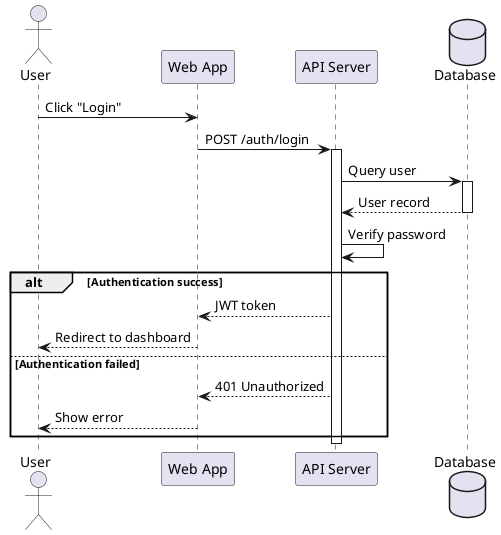

**Convert:**
```bash
plantuml -tpdf api_sequence.puml
# Or
plantuml_to_pdf.sh api_sequence.puml
```

**LaTeX:**
```latex
\begin{figure}[H]
    \centering
    \includegraphics[width=0.9\textwidth]{api_sequence.pdf}
    \caption{API authentication sequence diagram}
    \label{fig:api-seq}
\end{figure}
```

### Class Diagram

**File: `class_diagram.puml`**
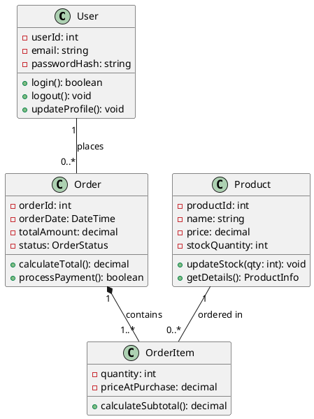

### Activity Diagram

**File: `workflow.puml`**
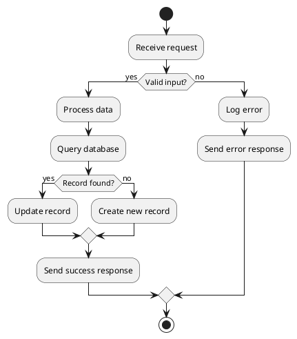

### Component Diagram

**File: `components.puml`**
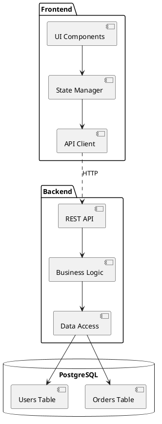

### State Diagram

**File: `state_machine.puml`**
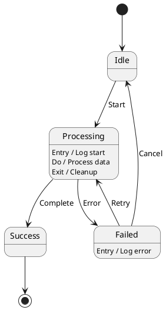

### Use Case Diagram

**File: `use_cases.puml`**
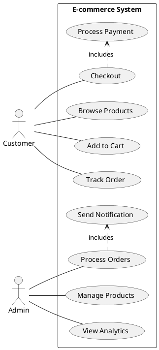

### Entity-Relationship Diagram

**File: `database_schema.puml`**
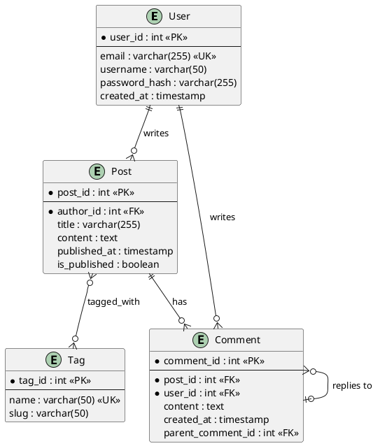

---

## Converting PlantUML to PDF/PNG

### Command-Line Usage

```bash
# Convert to PDF (recommended for LaTeX)
plantuml -tpdf diagram.puml

# Convert to PNG
plantuml -tpng diagram.puml

# Convert to SVG
plantuml -tsvg diagram.puml

# High-resolution PNG
plantuml -tpng -Sresolution=300 diagram.puml

# Batch convert all .puml files
plantuml -tpdf *.puml
```

### Using the Helper Script

```bash
# Basic usage (defaults to PDF)
plantuml_to_pdf.sh diagram.puml

# Specify output file
plantuml_to_pdf.sh diagram.puml --output result.pdf

# PNG format
plantuml_to_pdf.sh diagram.puml --format png

# SVG format
plantuml_to_pdf.sh diagram.puml --format svg

# Batch mode: convert all .puml files in directory
plantuml_to_pdf.sh diagrams/ --format pdf
```

---

## LaTeX Integration Best Practices

### 1. Use PDF Format for Vector Quality

Always prefer PDF over PNG for scalability:
```bash
dot -Tpdf diagram.dot -o diagram.pdf
plantuml -tpdf diagram.puml
```

### 2. Organize Diagram Files

```
project/
├── main.tex
├── diagrams/
│   ├── source/              # Source files
│   │   ├── architecture.dot
│   │   ├── sequence.puml
│   │   └── states.dot
│   └── generated/           # Generated PDFs
│       ├── architecture.pdf
│       ├── sequence.pdf
│       └── states.pdf
└── figures/                 # Other images
```

### 3. Makefile for Automatic Conversion

**File: `Makefile`**
```makefile
.PHONY: diagrams clean all

DIAGRAMS_SRC = diagrams/source
DIAGRAMS_OUT = diagrams/generated

DOT_FILES = $(wildcard $(DIAGRAMS_SRC)/*.dot)
PUML_FILES = $(wildcard $(DIAGRAMS_SRC)/*.puml)

DOT_PDFS = $(patsubst $(DIAGRAMS_SRC)/%.dot,$(DIAGRAMS_OUT)/%.pdf,$(DOT_FILES))
PUML_PDFS = $(patsubst $(DIAGRAMS_SRC)/%.puml,$(DIAGRAMS_OUT)/%.pdf,$(PUML_FILES))

diagrams: $(DOT_PDFS) $(PUML_PDFS)

$(DIAGRAMS_OUT)/%.pdf: $(DIAGRAMS_SRC)/%.dot
	@mkdir -p $(DIAGRAMS_OUT)
	dot -Tpdf $< -o $@

$(DIAGRAMS_OUT)/%.pdf: $(DIAGRAMS_SRC)/%.puml
	@mkdir -p $(DIAGRAMS_OUT)
	plantuml -tpdf $< -o $(DIAGRAMS_OUT)

main.pdf: main.tex diagrams
	pdflatex main.tex
	pdflatex main.tex

all: main.pdf

clean:
	rm -f *.aux *.log *.out
	rm -rf $(DIAGRAMS_OUT)/*.pdf
```

Usage:
```bash
make diagrams    # Generate all diagrams
make main.pdf    # Compile LaTeX (auto-generates diagrams)
make clean       # Remove generated files
```

### 4. Batch Conversion Script

**File: `generate_diagrams.sh`**
```bash
#!/bin/bash
set -e

SRC_DIR="diagrams/source"
OUT_DIR="diagrams/generated"
mkdir -p "$OUT_DIR"

echo "Converting Graphviz diagrams..."
for dot_file in "$SRC_DIR"/*.dot; do
    if [ -f "$dot_file" ]; then
        filename=$(basename "$dot_file" .dot)
        echo "  $filename.dot -> $filename.pdf"
        dot -Tpdf "$dot_file" -o "$OUT_DIR/${filename}.pdf"
    fi
done

echo "Converting PlantUML diagrams..."
for puml_file in "$SRC_DIR"/*.puml; do
    if [ -f "$puml_file" ]; then
        filename=$(basename "$puml_file" .puml)
        echo "  $filename.puml -> $filename.pdf"
        plantuml -tpdf "$puml_file" -o "$(realpath "$OUT_DIR")"
    fi
done

echo "Done! Generated diagrams in $OUT_DIR/"
```

### 5. LaTeX Figure Environment

```latex
\begin{figure}[H]
    \centering
    \includegraphics[width=0.8\textwidth]{diagrams/generated/architecture.pdf}
    \caption{System architecture showing component relationships and data flow}
    \label{fig:architecture}
\end{figure}

% Reference in text
As shown in Figure~\ref{fig:architecture}, the system consists of three layers.
```

### 6. Sizing Options

```latex
% Fixed width
\includegraphics[width=0.8\textwidth]{diagram.pdf}

% Fixed height
\includegraphics[height=10cm]{diagram.pdf}

% Scale
\includegraphics[scale=0.75]{diagram.pdf}

% Maximum size (preserves aspect ratio)
\includegraphics[width=0.9\textwidth,height=0.6\textheight,keepaspectratio]{diagram.pdf}

% Rotate
\includegraphics[angle=90,width=\textwidth]{wide_diagram.pdf}
```

### 7. Side-by-Side Diagrams

```latex
\usepackage{subcaption}

\begin{figure}[H]
    \centering
    \begin{subfigure}[b]{0.45\textwidth}
        \centering
        \includegraphics[width=\textwidth]{before.pdf}
        \caption{Before refactoring}
        \label{fig:before}
    \end{subfigure}
    \hfill
    \begin{subfigure}[b]{0.45\textwidth}
        \centering
        \includegraphics[width=\textwidth]{after.pdf}
        \caption{After refactoring}
        \label{fig:after}
    \end{subfigure}
    \caption{Dependency graph comparison}
    \label{fig:comparison}
\end{figure}
```

---

## When to Use Which Tool

### Graphviz vs PlantUML vs TikZ

| Aspect | Graphviz | PlantUML | TikZ |
|--------|----------|----------|------|
| **Best For** | Graphs, dependencies | UML diagrams | Math diagrams |
| **Layout** | Automatic | Automatic | Manual |
| **Learning Curve** | Low | Low | High |
| **Customization** | Limited | Limited | Full control |
| **LaTeX Math** | Via dot2tex | No | Native |
| **Professional UML** | No | Yes | Manual |
| **Large Graphs** | Excellent | Good | Poor |

### Use Graphviz For:
- **Dependency graphs** (code modules, build systems)
- **Network topologies** (servers, routers)
- **State machines** (FSMs, protocols)
- **Call graphs** (function relationships)
- **Data structures** (trees, linked lists)
- **Automatic layout** is desired

### Use PlantUML For:
- **UML diagrams** (class, sequence, component)
- **Software architecture** (component diagrams)
- **API documentation** (sequence diagrams)
- **Database schemas** (ER diagrams)
- **Use cases** (requirements)
- **Professional UML** is required

### Use TikZ For:
- **Mathematical diagrams** (geometry, proofs)
- **Precise control** over every element
- **LaTeX math** embedded in diagrams
- **Custom graphics** and illustrations
- **Perfect alignment** with text

### Hybrid Approach

Use multiple tools in the same document:
```latex
\documentclass{article}
\usepackage{graphicx}
\usepackage{tikz}

\begin{document}

% Graphviz: dependency graph
\begin{figure}[H]
    \includegraphics[width=0.8\textwidth]{dependencies.pdf}
    \caption{Module dependencies (Graphviz)}
\end{figure}

% PlantUML: sequence diagram
\begin{figure}[H]
    \includegraphics[width=0.9\textwidth]{api_flow.pdf}
    \caption{API interaction sequence (PlantUML)}
\end{figure}

% TikZ: mathematical diagram
\begin{figure}[H]
    \centering
    \begin{tikzpicture}
        \draw[->] (0,0) -- (3,0) node[right] {$x$};
        \draw[->] (0,0) -- (0,3) node[above] {$y$};
        \draw[blue] (0,0) circle (2);
    \end{tikzpicture}
    \caption{Unit circle (TikZ)}
\end{figure}

\end{document}
```

---

## Troubleshooting

### Graphviz Issues

**Problem:** Graph layout looks cluttered or overlapping.

**Solutions:**
1. Try different layout engine: `neato`, `fdp`, or `sfdp`
2. Adjust node spacing: `ranksep=1.5; nodesep=0.75;`
3. Use `rankdir=LR` instead of `TB` for wide graphs
4. Increase graph size: `size="8,6";`

**Problem:** Text is too small in PDF.

**Solutions:**
1. Increase font size: `node [fontsize=14];`
2. Use higher DPI for PNG: `dot -Tpng -Gdpi=300`
3. Adjust graph size attribute

### PlantUML Issues

**Problem:** "Cannot find plantuml.jar" or "Java not found".

**Solutions:**
1. Install Java: `sudo apt-get install default-jre`
2. Download PlantUML JAR manually
3. Use package manager installation

**Problem:** Diagram text is cut off or too small.

**Solutions:**
1. Use `-Sresolution=300` for higher resolution
2. Adjust diagram scale in source: `scale 1.5`
3. Use PDF format instead of PNG

### LaTeX Compilation Issues

**Problem:** `File 'diagram.pdf' not found`.

**Solutions:**
1. Verify diagram file exists in correct location
2. Use absolute paths or paths relative to .tex file
3. Check file extension matches actual format
4. Run diagram generation script first

**Problem:** Diagram appears pixelated or low quality.

**Solutions:**
1. Use PDF format instead of PNG
2. Increase resolution for PNG: `-Gdpi=300` or `-Sresolution=300`
3. Regenerate diagram with vector output

---

## Helper Scripts Reference

### graphviz_to_pdf.sh

```bash
# Basic usage
graphviz_to_pdf.sh input.dot

# Specify output
graphviz_to_pdf.sh input.dot --output result.pdf

# PNG format
graphviz_to_pdf.sh input.dot --format png

# Different engine
graphviz_to_pdf.sh input.dot --engine neato

# Batch mode
graphviz_to_pdf.sh diagrams/ --format pdf
```

Features:
- Auto-installs Graphviz if missing
- Supports all layout engines (dot, neato, circo, fdp, twopi, sfdp)
- Batch processing for directories
- Input validation

### plantuml_to_pdf.sh

```bash
# Basic usage
plantuml_to_pdf.sh diagram.puml

# Specify output
plantuml_to_pdf.sh diagram.puml --output result.pdf

# PNG format
plantuml_to_pdf.sh diagram.puml --format png

# SVG format
plantuml_to_pdf.sh diagram.puml --format svg

# Batch mode
plantuml_to_pdf.sh diagrams/ --format pdf
```

Features:
- Auto-installs PlantUML if missing
- Supports PDF, PNG, SVG formats
- Batch processing for directories
- Input validation

---

## External Resources

### Graphviz
- **Official Documentation**: https://graphviz.org/documentation/
- **Gallery**: https://graphviz.org/gallery/
- **Attribute Reference**: https://graphviz.org/doc/info/attrs.html
- **Node Shapes**: https://graphviz.org/doc/info/shapes.html
- **dot2tex**: https://dot2tex.readthedocs.io/

### PlantUML
- **Official Documentation**: https://plantuml.com/
- **Sequence Diagrams**: https://plantuml.com/sequence-diagram
- **Class Diagrams**: https://plantuml.com/class-diagram
- **Activity Diagrams**: https://plantuml.com/activity-diagram-beta
- **Online Server**: https://www.plantuml.com/plantuml/ (test diagrams online)
- **Real-World Examples**: https://real-world-plantuml.com/

### LaTeX Integration
- **graphicx Package**: https://ctan.org/pkg/graphicx
- **float Package**: https://ctan.org/pkg/float
- **subcaption Package**: https://ctan.org/pkg/subcaption
