# Mermaid Diagrams in LaTeX

## Overview

**Mermaid** is a text-based diagramming tool that uses simple markdown-like syntax to create diagrams. It's particularly useful for software documentation, flowcharts, and technical diagrams.

### What is Mermaid?

Mermaid allows you to create diagrams using plain text descriptions. For example:

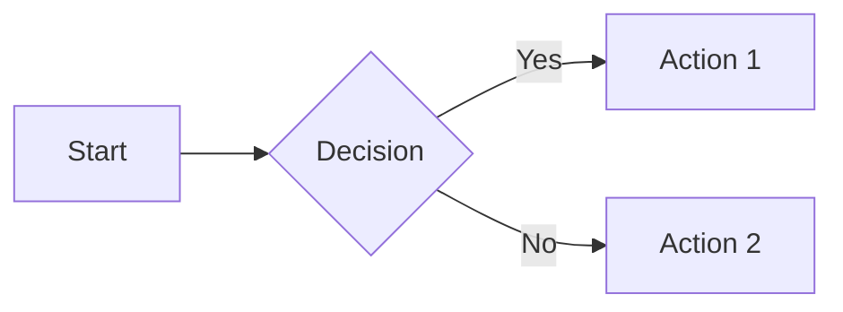

This simple text generates a flowchart diagram.

### Why Use Mermaid with LaTeX?

**Advantages:**
- **Simple syntax** - easier to write and maintain than TikZ
- **Fast prototyping** - quick to create and iterate
- **Version control friendly** - plain text, easy to diff
- **No LaTeX learning curve** - accessible to non-LaTeX users
- **Quick collaboration** - team members can edit without LaTeX knowledge

**Disadvantages:**
- **Requires extra step** - must convert to image format
- **Less control** - not as customizable as TikZ
- **Image quality** - raster formats may not scale as well
- **Limited to diagram types** - not suitable for all visualizations

### Typical Workflow

```
1. Write diagram in .mmd file
   ↓
2. Convert to PNG/PDF using mermaid-cli
   ↓
3. Include in LaTeX with \includegraphics
   ↓
4. Compile LaTeX document
```

---

## Installation

### Mermaid CLI (Required)

Install the Mermaid command-line interface:

```bash
# Using npm (recommended)
npm install -g @mermaid-js/mermaid-cli

# Verify installation
mmdc --version
```

### LaTeX Packages (Required)

```latex
\usepackage{graphicx}  % For \includegraphics
\usepackage{float}     % For H placement specifier
```

---

## Using the mermaid_to_image.sh Script

The skill includes a helper script for converting Mermaid diagrams to images.

### Basic Usage

```bash
# Convert to PNG (default)
mermaid_to_image.sh diagram.mmd

# Convert to PDF
mermaid_to_image.sh diagram.mmd --format pdf

# Convert to SVG
mermaid_to_image.sh diagram.mmd --format svg

# Specify output filename
mermaid_to_image.sh diagram.mmd --output flowchart.png

# Set theme
mermaid_to_image.sh diagram.mmd --theme dark

# Set dimensions
mermaid_to_image.sh diagram.mmd --width 800 --height 600
```

### Script Features

- **Auto-installs mermaid-cli** if missing
- **Multiple format support** - PNG, PDF, SVG
- **Theme support** - default, dark, forest, neutral
- **Custom dimensions** - specify width and height
- **Background options** - transparent or colored
- **Error handling** - validates .mmd syntax

---

## Flowcharts

Flowcharts show process flows and decision logic.

### Complete Example

**File: `process_flow.mmd`**
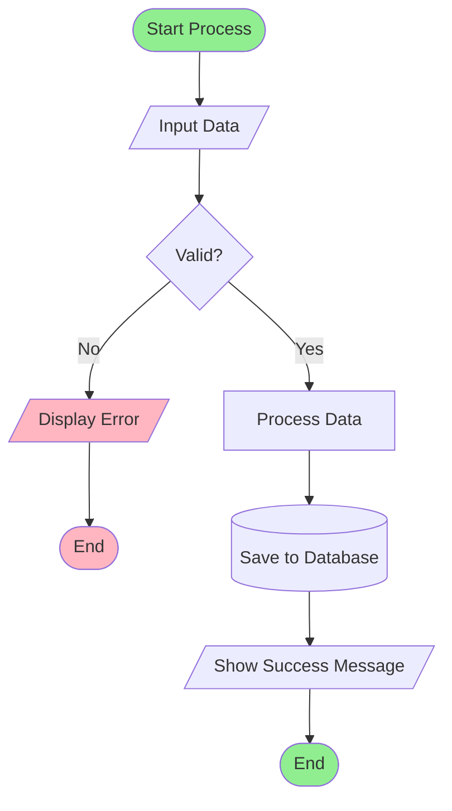

**Convert to Image:**
```bash
mermaid_to_image.sh process_flow.mmd --format pdf
```

**LaTeX Integration:**
```latex
\begin{figure}[H]
    \centering
    \includegraphics[width=0.8\textwidth]{process_flow.pdf}
    \caption{Data processing flowchart showing validation and error handling}
    \label{fig:process-flow}
\end{figure}

As shown in Figure~\ref{fig:process-flow}, the process validates
input data before processing.
```

### Flowchart Syntax

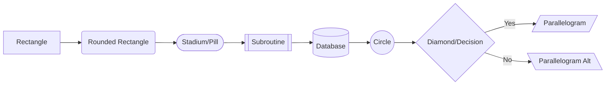

**Directions:**
- `LR` - Left to Right
- `RL` - Right to Left
- `TB` or `TD` - Top to Bottom
- `BT` - Bottom to Top

**Arrow Types:**
- `-->` - Solid arrow
- `-.->` - Dotted arrow
- `==>` - Thick arrow
- `--text-->` - Arrow with label

---

## Sequence Diagrams

Sequence diagrams show interactions between components over time.

### Example: User Authentication

**File: `auth_sequence.mmd`**
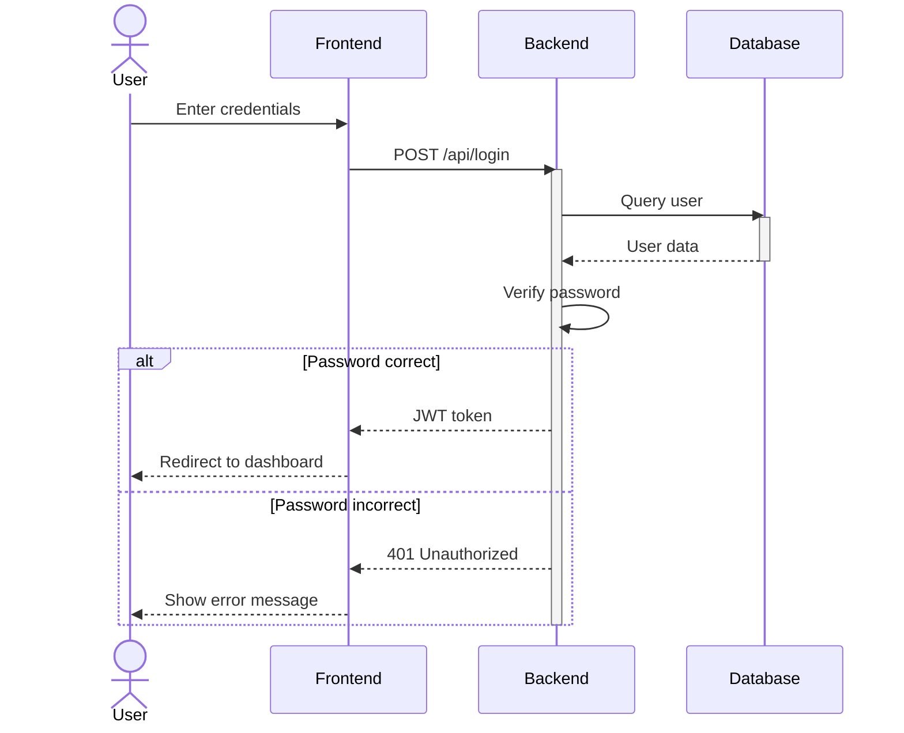

**LaTeX Integration:**
```latex
\begin{figure}[H]
    \centering
    \includegraphics[width=0.9\textwidth]{auth_sequence.pdf}
    \caption{Sequence diagram of user authentication flow}
    \label{fig:auth-sequence}
\end{figure}
```

### Sequence Diagram Features

- **Participants**: `participant Name`
- **Actors**: `actor Name`
- **Arrows**: `->`, `-->`, `->>`, `-->>` (various styles)
- **Activation**: `activate`/`deactivate` blocks
- **Notes**: `Note over A,B: Text`
- **Loops**: `loop text ... end`
- **Alternatives**: `alt ... else ... end`
- **Parallel**: `par ... and ... end`

---

## Class Diagrams

Class diagrams show object-oriented structure and relationships.

### Example: E-commerce System

**File: `ecommerce_classes.mmd`**
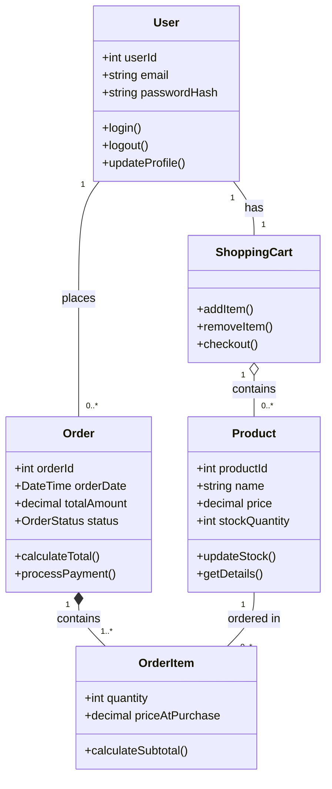

**LaTeX Integration:**
```latex
\begin{figure}[H]
    \centering
    \includegraphics[width=\textwidth]{ecommerce_classes.pdf}
    \caption{Class diagram of the e-commerce system architecture}
    \label{fig:class-diagram}
\end{figure}
```

### Class Diagram Relationships

- `--|>` - Inheritance
- `--*` - Composition
- `--o` - Aggregation
- `-->` - Association
- `--` - Link
- `..|>` - Realization
- `..>` - Dependency

---

## State Diagrams

State diagrams show state transitions in a system.

### Example: Order Status

**File: `order_states.mmd`**
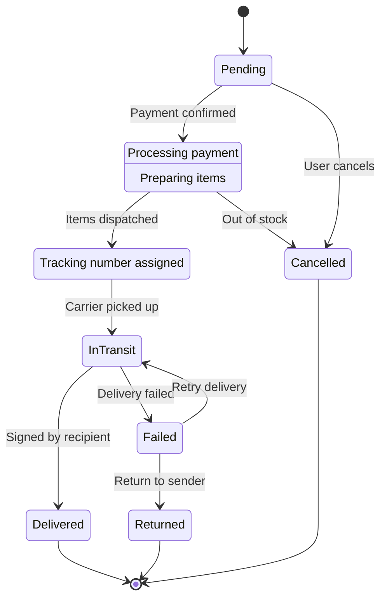

**LaTeX Integration:**
```latex
\begin{figure}[H]
    \centering
    \includegraphics[width=0.8\textwidth]{order_states.pdf}
    \caption{State diagram showing order lifecycle transitions}
    \label{fig:order-states}
\end{figure}
```

---

## Entity Relationship Diagrams (ERD)

ER diagrams show database structure and relationships.

### Example: Blog Database

**File: `blog_erd.mmd`**
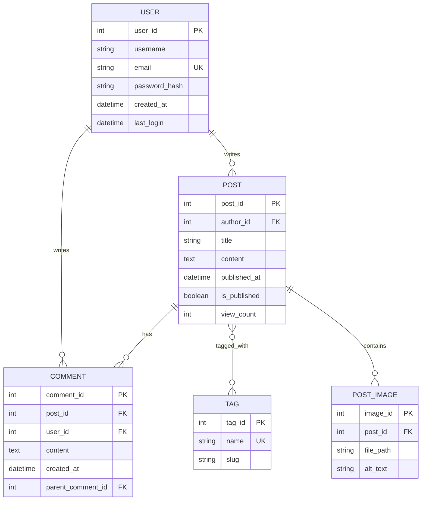

**LaTeX Integration:**
```latex
\begin{figure}[H]
    \centering
    \includegraphics[width=\textwidth]{blog_erd.pdf}
    \caption{Entity-relationship diagram of the blog database schema}
    \label{fig:blog-erd}
\end{figure}
```

### ER Diagram Relationships

- `||--||` - One to one
- `||--o{` - One to many
- `}o--o{` - Many to many
- `||--o|` - One to zero or one

---

## Gantt Charts

Gantt charts show project timelines and task dependencies.

### Example: Software Development

**File: `project_timeline.mmd`**
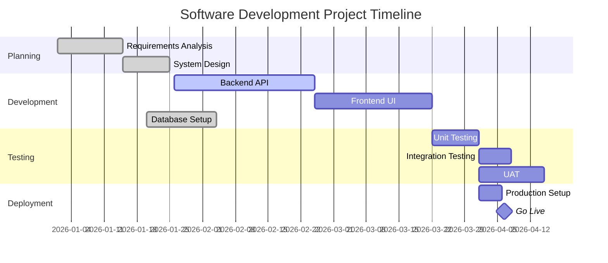

**LaTeX Integration:**
```latex
\begin{figure}[H]
    \centering
    \includegraphics[width=\textwidth]{project_timeline.pdf}
    \caption{Project Gantt chart showing development phases and milestones}
    \label{fig:gantt}
\end{figure}
```

---

## Pie Charts

Pie charts show proportional data.

### Example: Budget Allocation

**File: `budget_pie.mmd`**
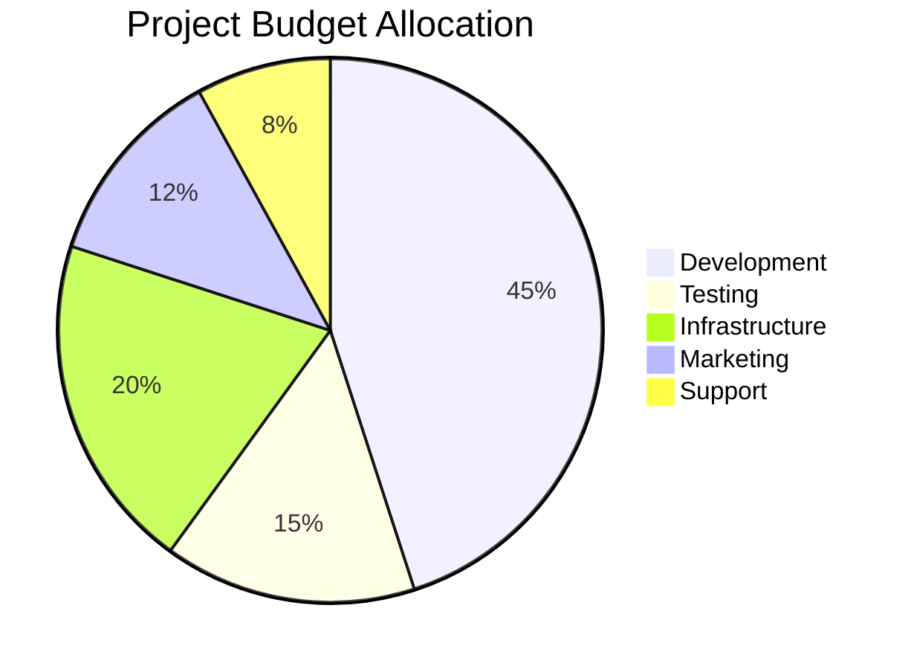

**LaTeX Integration:**
```latex
\begin{figure}[H]
    \centering
    \includegraphics[width=0.6\textwidth]{budget_pie.pdf}
    \caption{Project budget distribution across departments}
    \label{fig:budget}
\end{figure}
```

---

## Mindmaps

Mindmaps show hierarchical relationships and brainstorming.

### Example: Machine Learning Topics

**File: `ml_mindmap.mmd`**
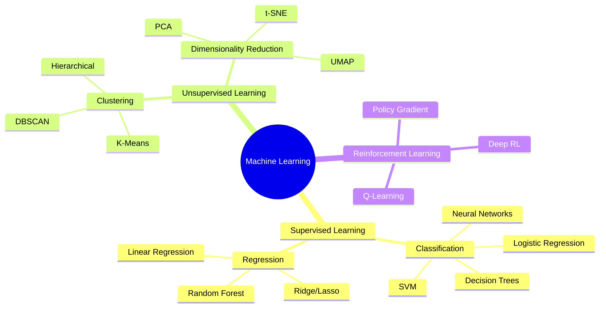

**LaTeX Integration:**
```latex
\begin{figure}[H]
    \centering
    \includegraphics[width=0.9\textwidth]{ml_mindmap.pdf}
    \caption{Mindmap of machine learning taxonomy and algorithms}
    \label{fig:ml-mindmap}
\end{figure}
```

---

## Timeline Diagrams

Timeline diagrams show chronological events.

### Example: Product Evolution

**File: `product_timeline.mmd`**
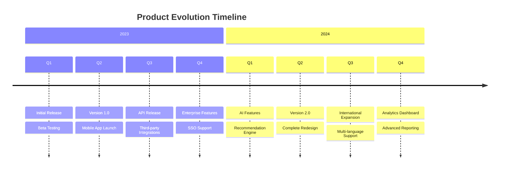

**LaTeX Integration:**
```latex
\begin{figure}[H]
    \centering
    \includegraphics[width=\textwidth]{product_timeline.pdf}
    \caption{Product development timeline showing major releases and features}
    \label{fig:timeline}
\end{figure}
```

---

## Styling and Themes

### Available Themes

Mermaid supports several built-in themes:

1. **default** - Standard blue and white theme
2. **dark** - Dark background with light text
3. **forest** - Green color scheme
4. **neutral** - Grayscale theme

### Applying Themes

**Using Script:**
```bash
mermaid_to_image.sh diagram.mmd --theme dark
```

**Using Config File:**

Create `mermaid_config.json`:
```json
{
  "theme": "dark",
  "themeVariables": {
    "primaryColor": "#BB2528",
    "primaryTextColor": "#fff",
    "primaryBorderColor": "#7C0000",
    "lineColor": "#F8B229",
    "secondaryColor": "#006100",
    "tertiaryColor": "#fff"
  }
}
```

Convert with config:
```bash
mmdc -i diagram.mmd -o diagram.pdf -c mermaid_config.json
```

### Custom Styling

Add style directives in the diagram:


### Class Definitions

Define reusable styles:

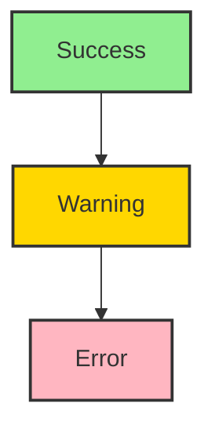

---

## LaTeX Integration Tips

### Sizing in LaTeX

Control diagram size with `\includegraphics` options:

```latex
% Fixed width
\includegraphics[width=0.8\textwidth]{diagram.pdf}

% Fixed height
\includegraphics[height=8cm]{diagram.pdf}

% Scale
\includegraphics[scale=0.75]{diagram.pdf}

% Maximum size (keeps aspect ratio)
\includegraphics[width=0.9\textwidth,height=0.5\textheight,keepaspectratio]{diagram.pdf}
```

### Caption and Label

Always add descriptive captions and labels:

```latex
\begin{figure}[H]
    \centering
    \includegraphics[width=0.8\textwidth]{flowchart.pdf}
    \caption{User registration process flowchart showing validation steps and error handling}
    \label{fig:user-registration}
\end{figure}

% Reference in text
See Figure~\ref{fig:user-registration} for the complete registration process.
```

### Figure Placement

Control where figures appear:

```latex
% HERE (requires float package)
\begin{figure}[H]

% Top of page
\begin{figure}[t]

% Bottom of page
\begin{figure}[b]

% Separate page
\begin{figure}[p]

% Let LaTeX decide (default)
\begin{figure}[htbp]
```

### Multiple Diagrams Side-by-Side

Use `subfigure` or `subcaption`:

```latex
\usepackage{subcaption}

\begin{figure}[H]
    \centering
    \begin{subfigure}[b]{0.45\textwidth}
        \centering
        \includegraphics[width=\textwidth]{before.pdf}
        \caption{Before optimization}
        \label{fig:before}
    \end{subfigure}
    \hfill
    \begin{subfigure}[b]{0.45\textwidth}
        \centering
        \includegraphics[width=\textwidth]{after.pdf}
        \caption{After optimization}
        \label{fig:after}
    \end{subfigure}
    \caption{System architecture comparison}
    \label{fig:comparison}
\end{figure}
```

### Rotating Diagrams

For wide diagrams, rotate to landscape:

```latex
\usepackage{rotating}

\begin{sidewaysfigure}
    \centering
    \includegraphics[width=0.9\textwidth]{wide_diagram.pdf}
    \caption{Complete system architecture (landscape view)}
    \label{fig:architecture}
\end{sidewaysfigure}
```

---

## When to Use Mermaid vs TikZ

### Comparison Table

| Aspect | Mermaid | TikZ |
|--------|---------|------|
| **Learning Curve** | Low - simple syntax | High - complex LaTeX |
| **Speed** | Fast - quick prototypes | Slow - detailed coding |
| **Customization** | Limited themes | Full control |
| **Quality** | Good (raster/vector) | Excellent (native vector) |
| **Collaboration** | Easy - non-LaTeX users | Hard - LaTeX experts only |
| **Integration** | External (image) | Native LaTeX |
| **Version Control** | Excellent (plain text) | Excellent (plain text) |
| **Maintenance** | Easy to update | More complex |
| **Best For** | Software diagrams, flowcharts | Mathematical diagrams, precise graphics |

### Use Mermaid When:

- Creating **software architecture diagrams**
- Drawing **flowcharts and process diagrams**
- Making **sequence diagrams** for API documentation
- Building **ER diagrams** for database documentation
- Collaborating with **non-LaTeX users**
- Need **quick iterations** and prototypes
- Diagram structure matters more than pixel-perfect appearance

### Use TikZ When:

- Creating **mathematical diagrams** (geometry, graphs)
- Need **precise control** over every element
- Drawing **complex custom shapes**
- Creating **annotated mathematical proofs**
- Want **native LaTeX integration** (no external images)
- Need **perfect alignment** with text
- Diagram requires **LaTeX math** embedded within it

### Hybrid Approach

You can use both in the same document:

- **Mermaid** for process flows and software architecture
- **TikZ** for mathematical diagrams and precise illustrations

```latex
\documentclass{article}
\usepackage{graphicx}
\usepackage{tikz}

\begin{document}

% Mermaid diagram (included as image)
\begin{figure}[H]
    \includegraphics[width=0.8\textwidth]{architecture.pdf}
    \caption{System architecture (created with Mermaid)}
\end{figure}

% TikZ diagram (native LaTeX)
\begin{figure}[H]
    \centering
    \begin{tikzpicture}
        \draw[->] (0,0) -- (2,0) node[right] {$x$};
        \draw[->] (0,0) -- (0,2) node[above] {$y$};
        \draw[domain=0:1.5,smooth,variable=\x,blue] plot ({\x},{\x*\x});
    \end{tikzpicture}
    \caption{Mathematical function (created with TikZ)}
\end{figure}

\end{document}
```

---

## Workflow Best Practices

### 1. Organize Diagram Files

```
project/
├── main.tex
├── diagrams/
│   ├── source/           # .mmd source files
│   │   ├── flowchart.mmd
│   │   ├── sequence.mmd
│   │   └── erd.mmd
│   └── generated/        # Generated images
│       ├── flowchart.pdf
│       ├── sequence.pdf
│       └── erd.pdf
└── figures/              # Other images
```

### 2. Conversion Script

Create `generate_diagrams.sh`:

```bash
#!/bin/bash
for mmd_file in diagrams/source/*.mmd; do
    filename=$(basename "$mmd_file" .mmd)
    mermaid_to_image.sh "$mmd_file" \
        --format pdf \
        --output "diagrams/generated/${filename}.pdf"
done
```

### 3. Makefile Integration

```makefile
.PHONY: diagrams clean

diagrams:
	@echo "Generating Mermaid diagrams..."
	@./generate_diagrams.sh

main.pdf: main.tex diagrams
	pdflatex main.tex
	pdflatex main.tex

clean:
	rm -f *.aux *.log *.out
	rm -f diagrams/generated/*.pdf
```

### 4. Version Control

Add to `.gitignore`:
```
# Generated diagram files
diagrams/generated/*.png
diagrams/generated/*.pdf

# But keep source files
!diagrams/source/*.mmd
```

Commit `.mmd` source files but not generated images (can regenerate anytime).

---

## Troubleshooting

### Diagram Not Rendering

**Problem:** `mmdc` command fails or produces blank output.

**Solutions:**
1. Validate syntax at https://mermaid.live/
2. Check for special characters that need escaping
3. Ensure all required dependencies installed (Puppeteer, Chrome)
4. Try different output format (PNG instead of PDF)

### Text Overlapping in Diagram

**Problem:** Labels and text overlap or are cut off.

**Solutions:**
1. Increase output dimensions: `--width 1200 --height 800`
2. Shorten node labels
3. Change layout direction (LR → TB)
4. Adjust spacing in diagram definition

### Poor Quality in PDF

**Problem:** Diagram looks pixelated or blurry in PDF.

**Solutions:**
1. Use PDF output format: `--format pdf`
2. Increase resolution for PNG: `--width 2400 --height 1800`
3. Use SVG and convert to PDF with Inkscape
4. Consider using TikZ for critical diagrams

### LaTeX Compilation Error

**Problem:** LaTeX fails to compile with included diagram.

**Solutions:**
1. Verify image file exists at specified path
2. Check file extension matches actual format
3. Ensure `graphicx` package is loaded
4. Use absolute paths or paths relative to .tex file
5. Check for spaces in filename (use underscores instead)

---

## Additional Resources

- **Mermaid Documentation**: https://mermaid.js.org/
- **Mermaid Live Editor**: https://mermaid.live/ (test diagrams online)
- **Mermaid CLI**: https://github.com/mermaid-js/mermaid-cli
- **Example Gallery**: https://mermaid.js.org/ecosystem/integrations.html
- **TikZ vs Mermaid**: When to use each approach
- **LaTeX graphicx**: https://ctan.org/pkg/graphicx
